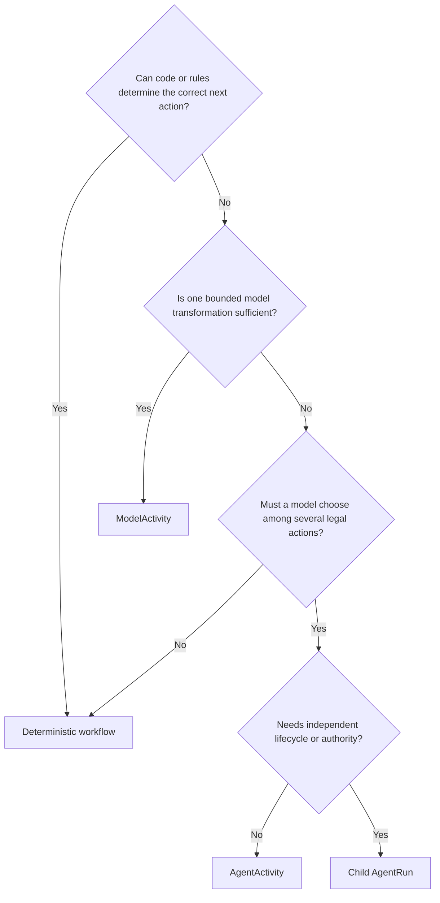

# Architecture decision guide

> **Status: Informative.** Canonical names are defined by the [ARA specification](/rfc/index).

## Deterministic or agentic?

## Activity or workflow?

Use an activity for one bounded semantic unit with one input and result contract. Use a referenced workflow when internal work has dependencies, branches, waits, several activities, or separately meaningful policy/evaluation.

## Inline or child?

Use inline execution when work shares parent state, budget, cancellation, and lifecycle. Use a child `WorkflowRun` or `AgentRun` when it needs an independent identity, state, budget, deadline, permissions, cancellation, failure status, or evaluation.

## Workflow or execution plan?

Use a workflow to coordinate activities inside one run. Use an execution plan when separate workflow runs have independent versions, ownership, schedules, decisions, or cross-day dependencies.

## Which repetition or retry concept?

| Situation | Use |
|---|---|
| Complete activity restarts from its boundary | `ActivityAttempt` |
| Worker resumes durable work after lease loss | New `WorkerLease` |
| One provider call retries, polls, or reconciles | New `Invocation` for the same `Effect` |
| Prompt/context/arguments/objective change | New `Effect` |
| Intentional sequential cycle | `Iteration` |
| Independent parallel candidate | `ExecutionBranch` |
| Independent experimental replicate | `ExperimentTrial` |
| User-visible phase | Qualified `UIProgressStep` |
| Discussion cycle | Qualified `DeliberationRound` mapped to `Iteration` |

## State, artifact, or memory?

| Data | Store |
|---|---|
| Small control value | Workflow state |
| Small typed result | Activity result |
| Large/reusable content | Artifact |
| Reusable governed knowledge | Memory record |
| Business truth | Domain aggregate/reference |
| Resume optimization | Checkpoint |

## Library, service, durable backend, or actor?

- Kernel library: pure state evolution and local tests.
- Runtime Service: tenant-aware distributed coordination.
- Durable backend: timers, signals, suspension, recovery behind `DurableExecutionPort`.
- Lease/actor: temporary serialization and ownership.
- Production default: combine them without making one abstraction own every concern.

## Shared or dedicated tenancy?

Start shared with strict tenant keys, quotas, and gateways. Move through schemas and tenant databases to dedicated cells when risk, residency, noisy-neighbor exposure, performance, or contract justifies the cost.

## Bundle, service, application, or platform?

- A bundle groups related versioned assets.
- A service exposes a callable operational contract.
- An application adds domain outcomes and UX.
- A platform supports many services, applications, teams, and tenants.
