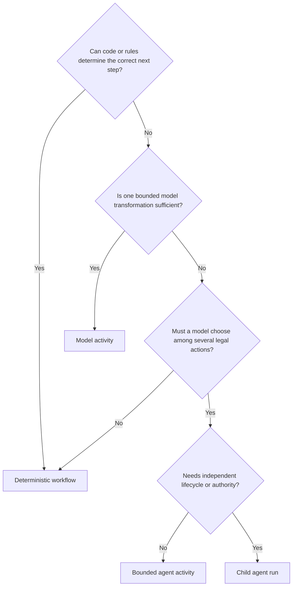

# Architecture decision guide

## Deterministic or agentic?

## Activity or workflow?

Use an activity for one bounded unit with one input and result contract. Use a workflow when the work has internal dependencies, branches, waits, independent policies, or several activities. A referenced workflow may run nested or as a child depending on lifecycle needs.

## Workflow or execution plan?

Use a workflow to coordinate activities inside one run. Use an execution plan when multiple workflow runs have separate versions, ownership, schedules, evaluations, decisions, or cross-day dependencies.

## Retry or iteration?

- Retry after operational failure: same logical input and `ActivityRun`, new `AttemptRun`.
- Iterate intentionally: new state/evidence/objective, new `IterationRun` and input snapshot.

## Inline state, artifact, or memory?

| Data | Store |
|---|---|
| Small control value | Workflow state |
| Small typed result | Activity result |
| Large/reusable content | Artifact |
| Reusable governed knowledge | Memory record |
| Business truth | Domain aggregate/reference |
| Recovery optimization | Checkpoint |

## Nested or child?

Use child execution when independent run identity, state, budget, permissions, deadline, cancellation, failure, evaluation, or long suspension is required. Otherwise keep execution within the parent activity/workflow lifecycle.

## Library, service, engine, or actor?

- Library: local kernel and tests.
- Runtime service: tenant-aware distributed operation.
- Durable engine: timers, signals, retries, recovery.
- Actor/lease: hot-state serialization.
- Recommended production default: combine them; do not force one to own every concern.

## Shared or dedicated tenancy?

Start shared with strong tenant keys and quotas. Move through schemas and tenant databases to dedicated cells when data risk, noisy-neighbor exposure, residency, performance, or contract justifies the added cost.

## Bundle, service, or application?

- Multiple related definitions form an **agentic bundle**.
- A deployed callable contract forms an **agentic service**.
- Domain behavior and UX form an **agentic application**.
- Shared build/run/govern infrastructure forms a **platform**.
