# Mermaid diagram pack

> **Status: Reference diagrams.** Diagrams illustrate the [ARA specification](/specification/index); the specification remains authoritative when a visual omits detail.

## 1. Terminology map

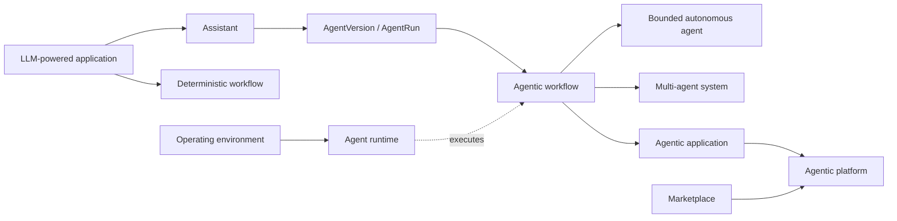

## 2. System context

## 3. Container architecture

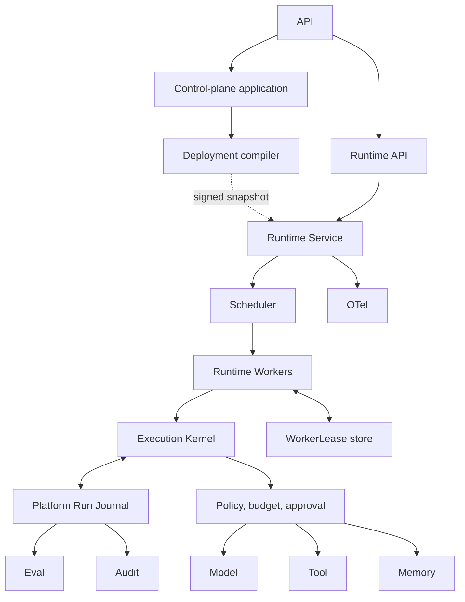

## 4. Dependency boundary

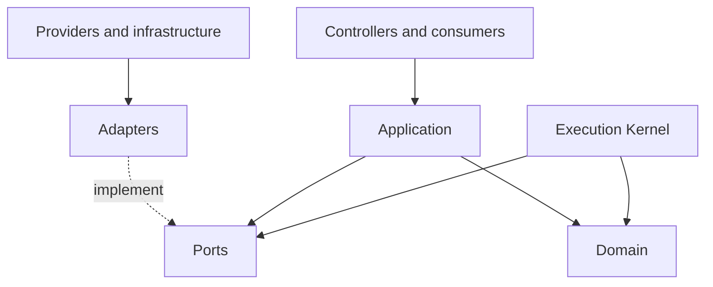

## 5. Ports and adapters

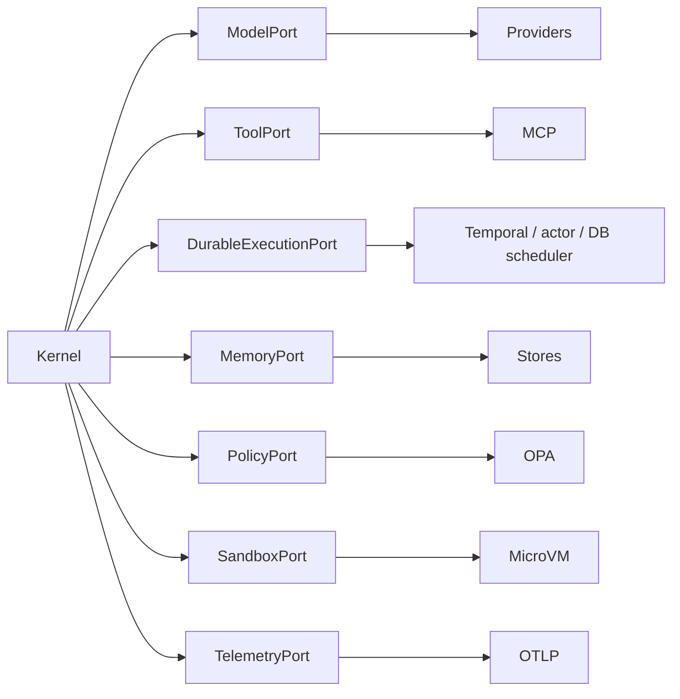

## 6. Control and execution planes

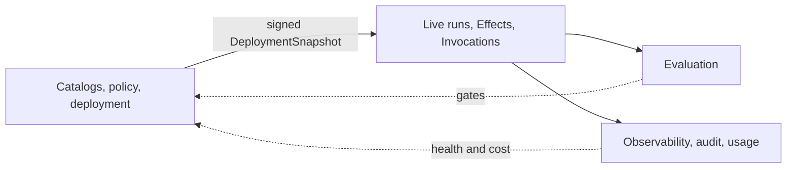

## 7. Complete run sequence

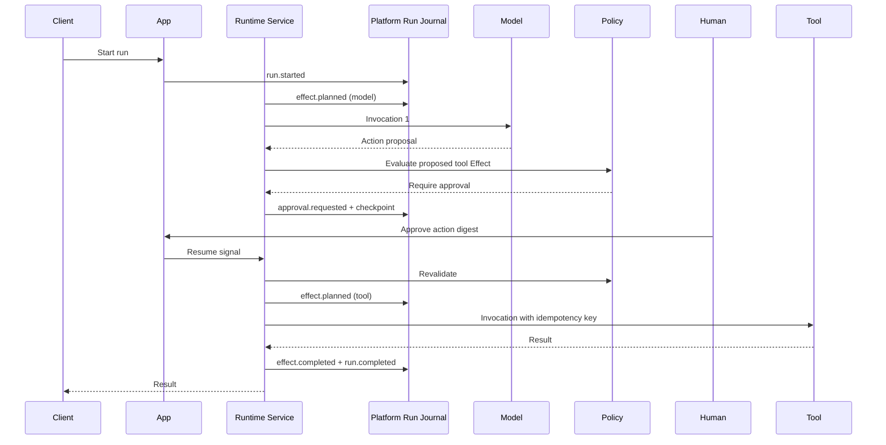

## 8. Long-running run state machine

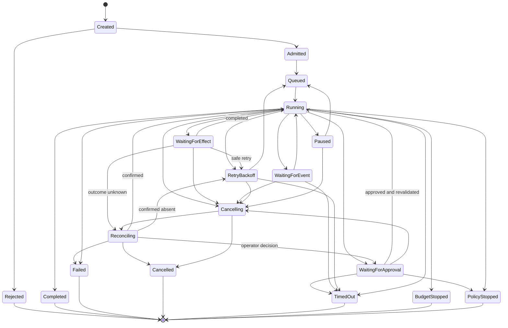

## 9. Tool-effect policy enforcement

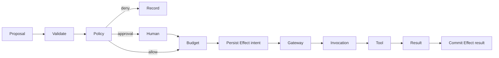

## 10. Human pause and resume

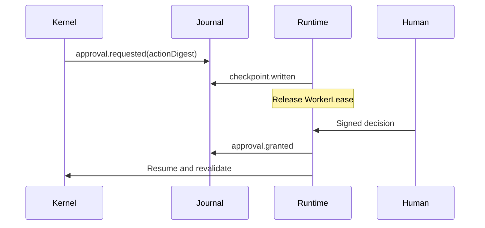

## 11. Evaluation feedback loop

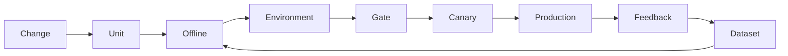

## 12. Multi-tenant execution cells

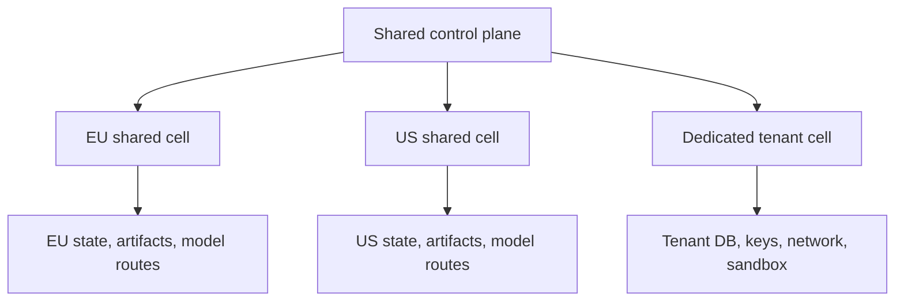

## 13. Marketplace package lifecycle

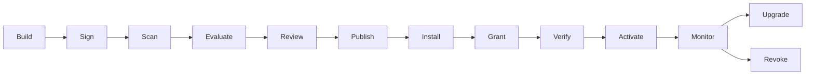

## 14. Failure and recovery

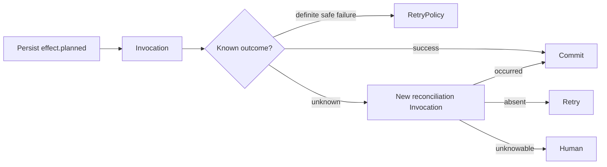

## 15. Event and data lineage

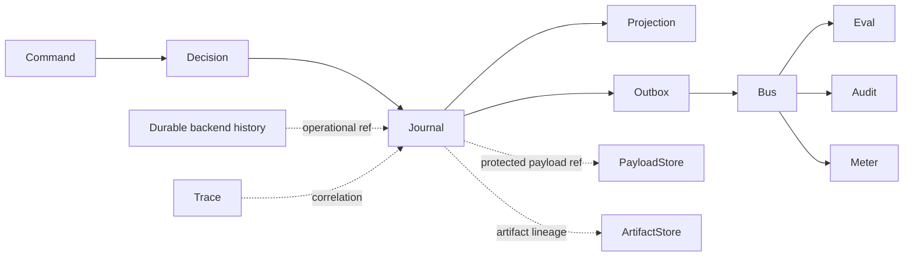
