# Mermaid diagram pack

## 1. Terminology map

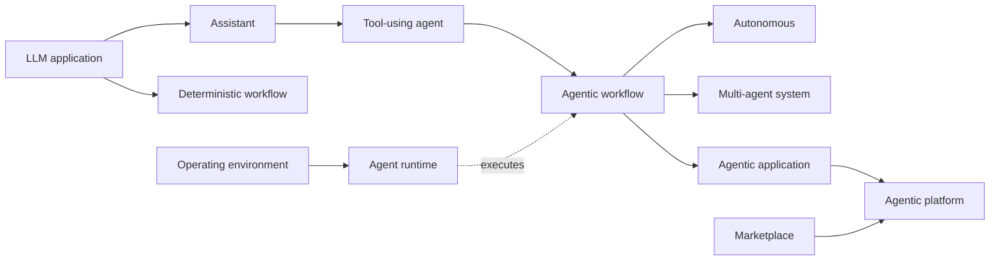

## 2. System context

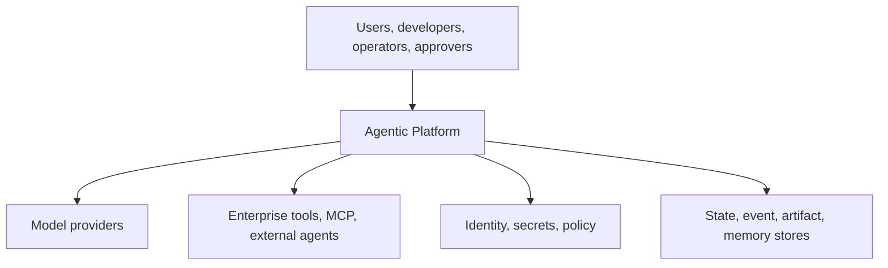

## 3. Container architecture

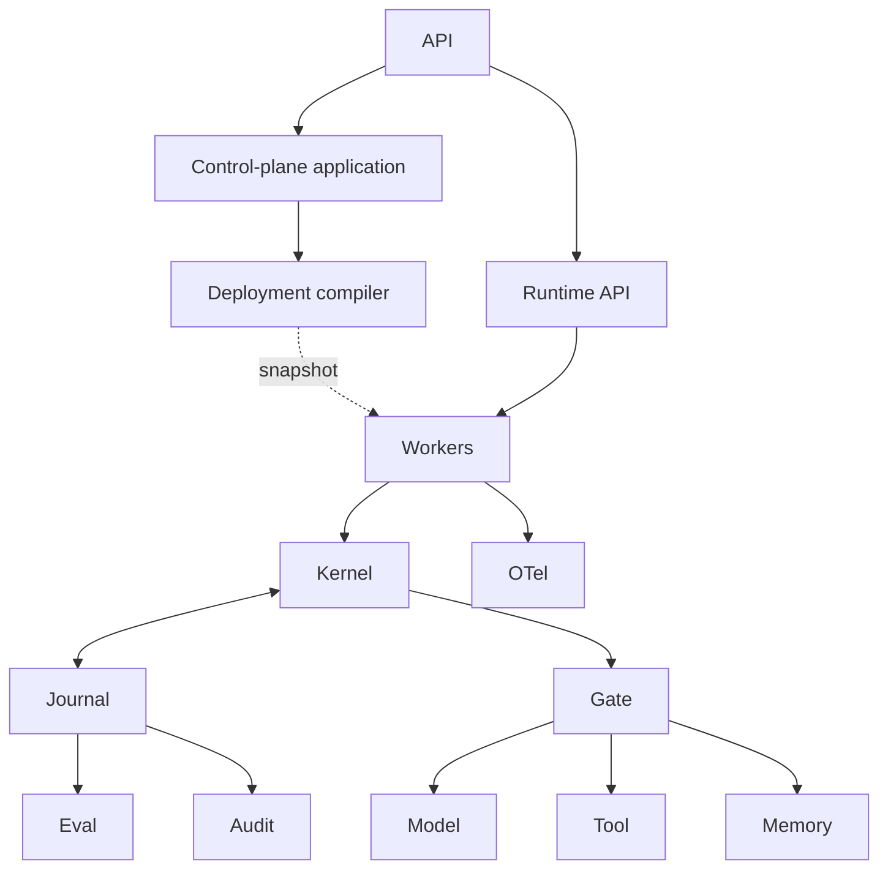

## 4. Dependency boundary

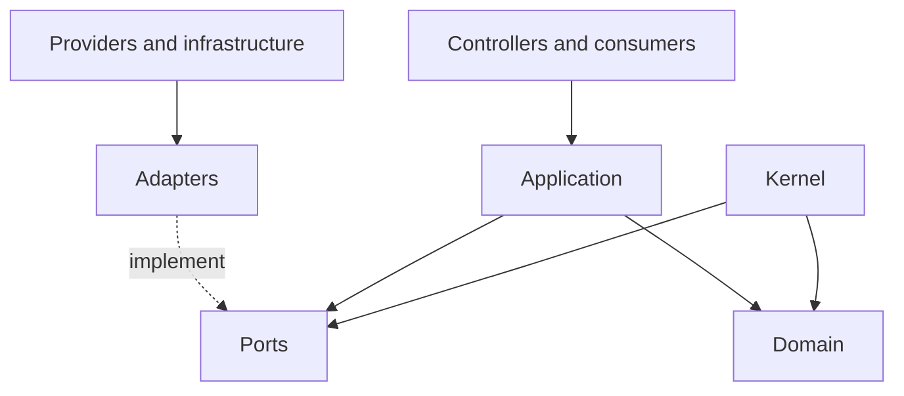

## 5. Ports and adapters

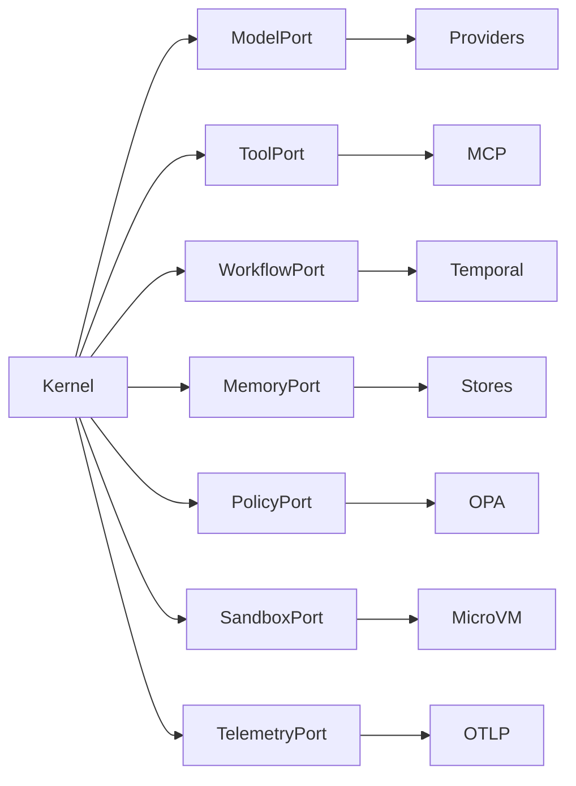

## 6. Control and execution planes

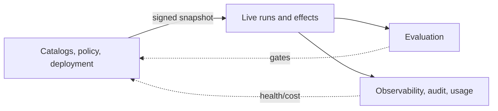

## 7. Complete run sequence

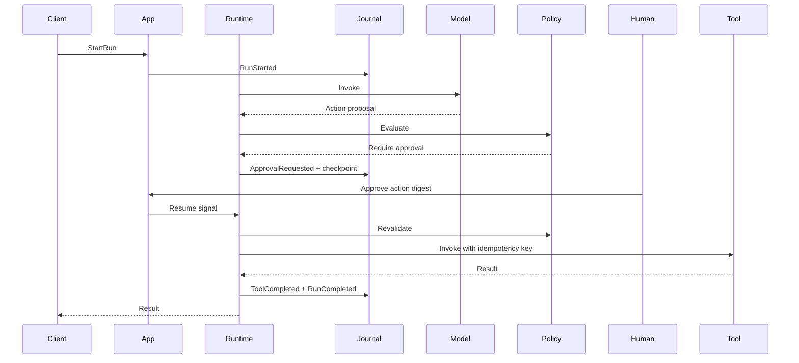

## 8. Long-running state machine

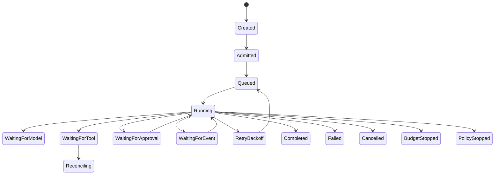

## 9. Tool-call policy enforcement

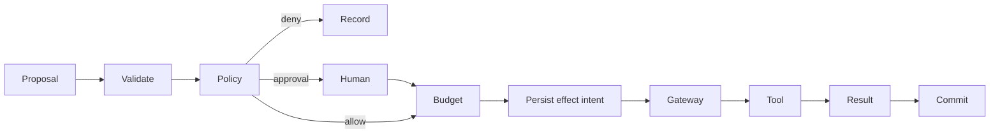

## 10. Human pause and resume

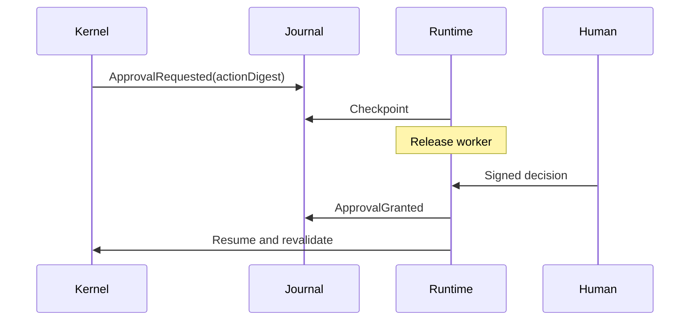

## 11. Evaluation feedback loop

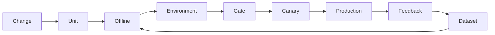

## 12. Multi-tenant cells

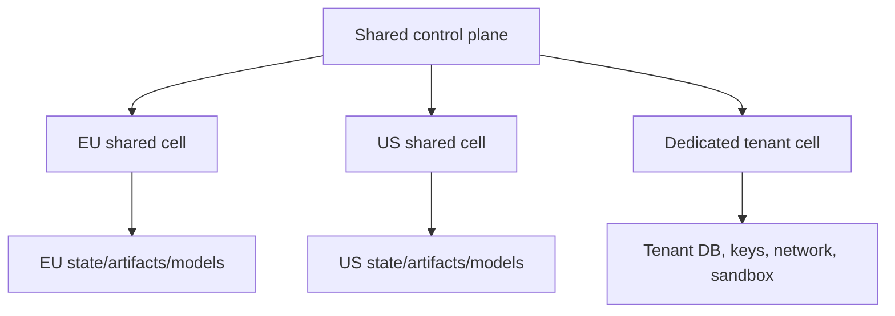

## 13. Marketplace lifecycle

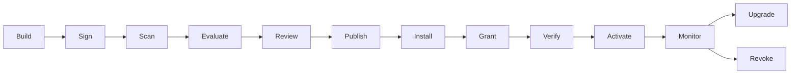

## 14. Failure and recovery

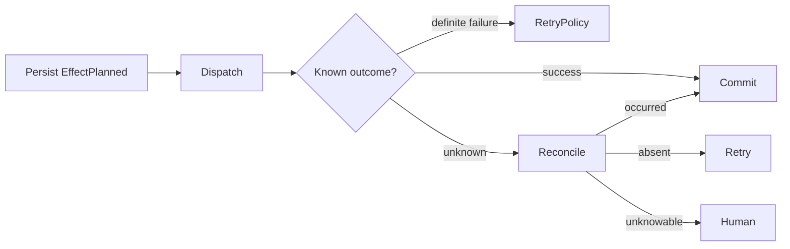

## 15. Event and data lineage

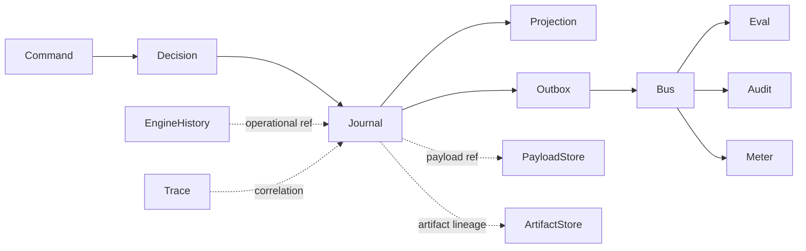
