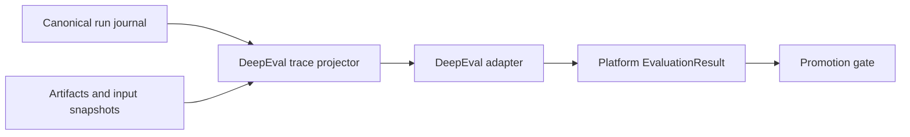

# DeepEval adapter guide

Use DeepEval for behavioral, semantic, component-level, and full-trajectory evaluation. As retrieved on July 12, 2026, its official agent-evaluation guidance covers plan quality/adherence, tool and argument correctness, task completion, step efficiency, traced components, datasets, and CI integration. See the [official agent evaluation guide](https://deepeval.com/guides/guides-ai-agent-evaluation) and [dataset documentation](https://deepeval.com/docs/evaluation-datasets).

## Architectural placement



DeepEval is an evaluation adapter. It is not the canonical run model, workflow engine, policy enforcement point, or audit ledger.

## Project runtime events into traces

| Platform evidence | Evaluation projection |
|---|---|
| `RunStarted` / `RunCompleted` | Root agent trace |
| `ActivityStarted` / result | Activity/component span |
| `ModelInvocationCompleted` | LLM span |
| `ToolInvocationCompleted` | Tool span |
| `ContextCompiled` | Retrieval/context span |
| `ActionProposed` | Planning/decision span or structured attribute |
| `ChildRunStarted` | Linked or nested agent span |
| `ArtifactProduced` | Output/evidence reference |

Keep the projector in the adapter layer. Do not instrument the runtime so deeply with framework-native evaluation objects that replacing the evaluator changes execution contracts.

## Metric selection

| Concern | Suitable metric family |
|---|---|
| Plan quality | Completeness, logical order, dependency handling |
| Plan adherence | Whether execution follows or justifiably revises the plan |
| Tool correctness | Correct capability and call sequence |
| Argument correctness | Correct, grounded, schema-valid arguments |
| Task completion | Whether the full trace achieves the task |
| Step efficiency | Unnecessary, repeated, or circuitous actions |
| Domain rubric | Custom criteria with calibrated judge or deterministic checks |

## Adapter pseudocode

```python
def evaluate_run(run_id: str, suite: EvaluationSuite) -> EvaluationResult:
    events = run_journal.load(run_id)
    evidence = artifact_store.resolve_for_evaluation(events)
    trace = deep_eval_projector.project(events, evidence)
    raw = deep_eval_adapter.run(trace=trace, suite=suite)
    return evaluation_mapper.to_platform_result(raw)
```

## Guardrails

- Do not ask an LLM judge to prove whether a payment, database row, or filesystem mutation occurred; verify the environment deterministically.
- Pin judge model/profile, rubric, prompt, threshold, and evaluator version.
- Calibrate judges against human-labeled anchors and monitor disagreement.
- Separate component and end-to-end metrics so a high final score cannot hide an unsafe tool trajectory.
- Record evaluator cost and latency.
