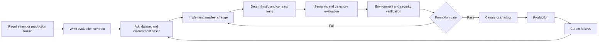

# Evaluation-driven development

Evaluation-driven development applies the test-first discipline to probabilistic systems.



## EDD sequence

1. State the user or business outcome.
2. Define deterministic invariants and prohibited outcomes.
3. Add representative, boundary, adversarial, and historical failure cases.
4. Define semantic, trajectory, cost, and latency metrics.
5. Run the current version to establish a baseline.
6. Implement the smallest behavior change.
7. Compare distributions across repeated trials where stochasticity matters.
8. Promote only if hard gates pass and regression tolerances hold.
9. Observe a canary and automatically roll back on declared triggers.
10. Convert reviewed production failures into durable cases.

## Evaluation contract

```yaml
kind: EvaluationSuite
metadata:
  name: procurement-agent-release
  version: 6.0.0
subject:
  agent: procurement-order-agent@5.2.0
datasets:
  behavioral: procurement-goldens@6.3.0
  environment: procurement-sandbox@3.1.0
  adversarial: procurement-security@2.2.0
metrics:
  taskCompletion: { minimumMean: 0.90 }
  toolCorrectness: { minimumMean: 0.98 }
  argumentCorrectness: { minimumMean: 0.95 }
hardGates:
  - zero_cross_tenant_access
  - zero_approval_bypass
  - zero_duplicate_irreversible_effects
operational:
  maximumP95CostUsd: 8.00
  maximumP95DurationSeconds: 180
```

## CI/CD tiers

| Stage | Suite | Purpose |
|---|---|---|
| Developer | Unit, mocks, small golden slice | Fast feedback |
| Pull request | Contracts, replay, representative DeepEval and Harbor smoke cases | Prevent obvious regression |
| Nightly | Full datasets, repeated trials, adversarial and fault injection | Distributional confidence |
| Release | Production configuration and critical hard gates | Promotion evidence |
| Canary | Sampled real traffic or shadow execution | Detect live regression |
| Production | Online sampling and all incidents | Feedback loop |

## Model-response mocking

Use mocks to force invalid JSON, refusal, partial stream, repeated tool proposal, rate limit, timeout, malicious tool output, and no-progress behavior. Mocks prove control-flow handling; they do not replace real-model evaluation.

## Baseline discipline

A baseline pins agent/workflow/prompt/tool versions, model-routing profile, dataset version, evaluator versions, trial count, environment digest, and scoring thresholds. Compare a candidate against the strongest relevant baseline, not a deliberately weak implementation.

## Stochastic confidence

For variable behavior, report pass rate, mean, dispersion, confidence interval where appropriate, worst critical slice, and repeated-trial failure modes. A single passing sample is weak evidence.
