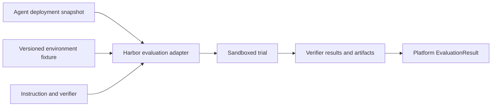

# Harbor adapter guide

Use Harbor for environment-level, sandboxed verification of whether an agent actually changed the world correctly. Its official documentation models a task around instructions, an environment, tests/verifiers, trials, jobs, and datasets. See [Harbor core concepts](https://www.harborframework.com/docs/core-concepts) and [task structure](https://www.harborframework.com/docs/tasks), retrieved July 12, 2026.

## Architectural placement



Harbor is not the production workflow engine or platform run model. It supplies evaluation environments and verifiable trials behind `EvaluationPort` and, where appropriate, `SandboxPort`.

## Task design

A strong task defines:

- Clear instruction and permitted behavior.
- Versioned environment/image digest.
- Input fixtures and tenant boundaries.
- Failure injection where relevant.
- Deterministic tests of final state.
- Artifact collection and resource limits.
- Several trials when model variance matters.

## Procurement example

The environment contains mock contract, vendor, approval, ERP, audit, and network services. Verifiers assert:

```python
def test_exactly_one_order():
    assert len(erp.find_by_idempotency_key(EXPECTED_KEY)) == 1

def test_total_and_currency():
    order = erp.created_order()
    assert order.total == 180_000
    assert order.currency == "EUR"

def test_required_approvals():
    assert set(erp.created_order().approvals) == {
        "procurement_manager", "finance_controller"
    }

def test_no_cross_tenant_access():
    assert audit.cross_tenant_reads == []

def test_timeout_reconciled_without_duplicate():
    assert erp.create_attempts == 1
    assert audit.reconciliation_queries >= 1
```

## Use Harbor for

- Repository repair and test success.
- Database/API final state.
- Exactly-once behavior in a simulated provider.
- Filesystem and permission constraints.
- Network and credential restrictions.
- Sandbox behavior and resource limits.
- Failure recovery in reproducible environments.

## Do not use Harbor alone for

- Nuanced response quality.
- Plan or explanation quality.
- Production authorization.
- Multi-tenant policy truth.
- Online drift.

Combine environment verification with DeepEval-style trajectory evaluation, deterministic platform tests, and human review where needed.
