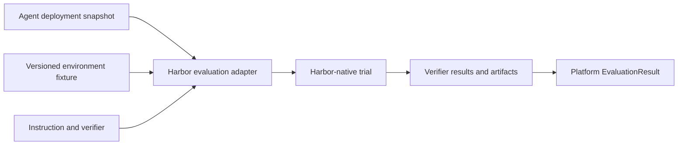

# Harbor adapter guide

> **Status: Informative adapter guide.**

Use Harbor for environment-level, sandboxed verification of whether an agent changed the world correctly. Its official documentation models tasks, environments, verifiers, trials, jobs, and datasets. See [Harbor core concepts](https://www.harborframework.com/docs/core-concepts) and [task structure](https://www.harborframework.com/docs/tasks), retrieved July 12, 2026.

## Architectural placement



Harbor is not the production durable backend or platform run model. It supplies evaluation environments and verifiable executions behind `EvaluationPort` and, where appropriate, `SandboxPort`.

## Trial terminology

Harbor uses **trial** for one agent execution against a task. The adapter records the native Harbor trial identifier and maps the execution as follows:

- If it is an independent repetition from a frozen experiment/evaluation baseline, create or reference an `ExperimentTrial` whose work is performed by a `WorkflowRun`.
- If it is merely one Harbor execution without an experiment aggregate, retain it as adapter evidence linked to the evaluated `WorkflowRun`; do not introduce a generic core trial entity.
- Provider retries, polling, and reconciliation inside the execution are `Invocation`s of their owning `Effect`s.

A Harbor trial is therefore never an invocation retry and never changes ARA’s core execution ontology.

## Task design

A strong task defines clear instruction and permitted behavior, pinned image/environment, fixtures and tenant boundaries, failure injection, deterministic final-state tests, artifact collection, resource limits, and repeated experiment trials when variance matters.

## Procurement verifier examples

```python
def test_exactly_one_order():
    assert len(erp.find_by_idempotency_key(EXPECTED_KEY)) == 1

def test_total_and_currency():
    order = erp.created_order()
    assert order.total == 180_000
    assert order.currency == "EUR"

def test_required_approvals():
    assert set(erp.created_order().approvals) == {
        "procurement_manager", "finance_controller"
    }

def test_no_cross_tenant_access():
    assert audit.cross_tenant_reads == []

def test_timeout_reconciled_without_duplicate():
    assert erp.create_requests == 1
    assert audit.reconciliation_queries >= 1
```

## Use Harbor for

Repository repair/tests, database/API final state, idempotency in simulated providers, filesystem/permission/network/credential constraints, sandbox limits, and failure recovery in reproducible environments.

## Do not use Harbor alone for

Nuanced response/plan quality, production authorization, multi-tenant policy truth, or online drift. Combine it with DeepEval-style trajectory evaluation, deterministic platform tests, and human review where needed.
