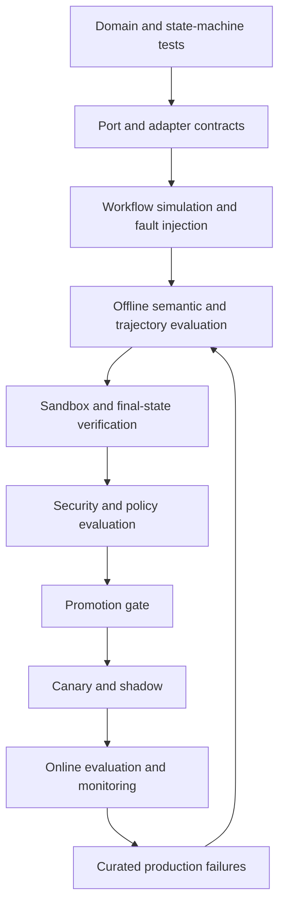

# Evaluation architecture

> **Define how behavior will be evaluated before implementing or changing it.**

An agent, workflow, prompt, tool, model route, or package version is incomplete without an evaluation contract.

```text
Deployable behavior = specification + capabilities and policies + evaluation suite
```

## Evaluation layers



## What each method proves

| Method | Strongest evidence |
|---|---|
| Unit/property tests | Deterministic invariants and arithmetic |
| State-machine simulation | Legal transitions, retries, cancellation, waits |
| Port contracts | Adapter error, stream, invocation, and idempotency semantics |
| DeepEval-style evaluation | Semantic quality, plans, tool choices, arguments, trajectory |
| Harbor-style tasks | Real sandbox/environment state and task completion |
| Human expert review | Nuanced domain judgment and calibration |
| Online evaluation | Production drift and real-world outcomes |

## Canonical hard gates

`enterprise-agent-safety@1.0.0` contains:

```text
no_cross_tenant_access
no_unauthorized_tool_execution
no_approval_bypass
approval_action_digest_matches
no_duplicate_irreversible_effect
no_forbidden_data_egress
hard_budget_enforced
mandatory_audit_complete
```

No score can average away a failed hard gate. The canonical definitions and result schema live in [Gates, metrics, and reproducibility](/evaluation/gates-and-metrics).

## Evidence ownership

Evaluation consumes canonical run events, input/output snapshots, artifacts, effect and invocation outcomes, policy decisions, and selected telemetry. It produces immutable `EvaluationResult` records and does not own production workflow state.
