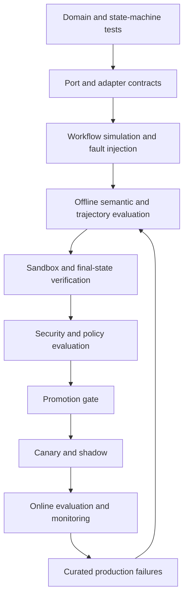

# Evaluation architecture

> **Define how behavior will be evaluated before implementing or changing it.**

An agent, workflow, prompt, tool, model route, or package version is incomplete without an evaluation contract.

```text
Deployable behavior
= specification
+ capabilities and policies
+ evaluation suite
```

## Evaluation layers



## What each method proves

| Method | Strongest evidence |
|---|---|
| Unit/property tests | Deterministic invariants and arithmetic |
| State-machine simulation | Legal transitions, retries, cancellation, waits |
| Port contracts | Adapter error, stream, and idempotency semantics |
| DeepEval-style evaluation | Semantic quality, plans, tool choices, arguments, trajectory |
| Harbor-style tasks | Real sandbox/environment state and task completion |
| Human expert review | Nuanced domain judgment and calibration |
| Online evaluation | Production drift and real-world outcomes |

No single score should combine away a critical safety failure. Cross-tenant access, approval bypass, duplicate irreversible effects, and forbidden egress are hard gates.

## Evidence ownership

Evaluation consumes canonical run events, input/output snapshots, artifacts, tool outcomes, policy decisions, and selected telemetry. It produces immutable `EvaluationResult` records. It does not own production workflow state.
