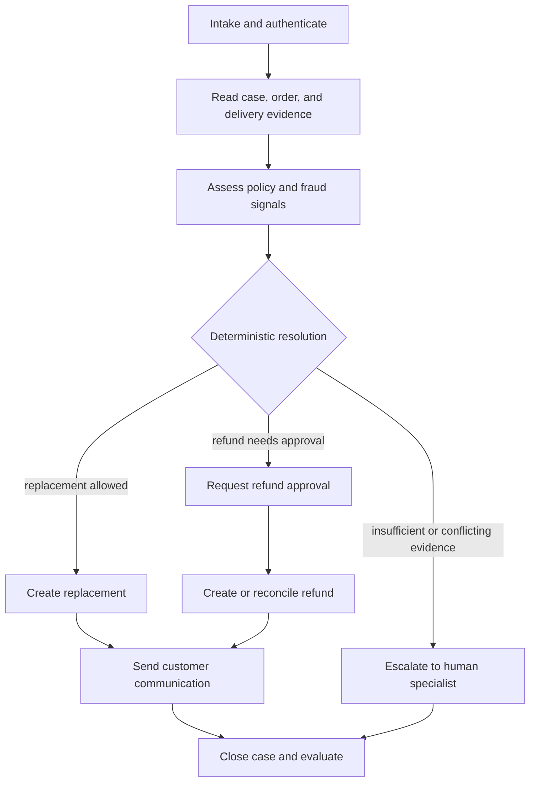
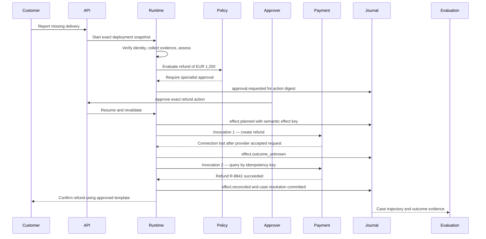

# Worked example — customer service case resolution

> **Status: Worked example.** Product, legal, and refund policies are illustrative; ARA semantics remain owned by the specification.

## Why this scenario

Customer service is a high-volume enterprise agent use case. ServiceNow publicly describes AI agents handling routine customer requests, issue resolution, and complex CRM processes across enterprise workflows. This example uses that demand pattern without adopting any vendor’s internal model. Source reviewed July 13, 2026: [ServiceNow AI Agents](https://www.servicenow.com/products/ai-agents.html).

## Business outcome

A customer reports that a high-value order was marked delivered but was not received. The service must:

```text
verify the customer and order
collect delivery evidence
apply regional retailer policy
resolve with replacement, refund, or human escalation
communicate the result
preserve complete case and financial evidence
```

The model may recommend a resolution. Deterministic policy and authorized humans decide whether a financial mutation is allowed.

## Non-goals

- The model does not authenticate the customer.
- Conversation history is not authoritative case or order state.
- Sentiment does not override refund policy.
- The support agent cannot silently expand its own tools or refund limit.
- A payment-provider timeout is not treated as a failed refund until reconciled.

## Applicable ARA modules

```text
ARA Core
ARA Durable
ARA Multi-Tenant
ARA Enterprise Operations
ARA High-Assurance for high-value financial actions
```

## Bounded contexts and resources

| Context | Owns |
|---|---|
| Customer identity | Authenticated customer, account, consent, verification strength |
| Service case | Case state, SLA, channel, disposition, escalation |
| Order management | Order, fulfillment, shipment, replacement eligibility |
| Payments | Refund operation and provider status |
| Policy | Regional service, fraud, refund, and approval rules |
| Conversation | Messages and channel delivery; not authoritative case state |
| Knowledge | Versioned policies, troubleshooting, and product information |
| Evaluation | Case datasets, trajectory checks, outcome and safety gates |

```text
Agent: customer-case-agent
AgentVersion: customer-case-agent@3.2.0
WorkflowVersion: missing-delivery-resolution@4.1.0
PolicyVersion: eu-missing-delivery@7.0.0
ToolVersions:
  customer.verify@2.0.0
  order.read@5.1.0
  carrier.delivery-evidence@3.0.0
  refund.create@4.4.0
  refund.status-by-idempotency-key@2.1.0
  message.send@3.2.0
```

## Workflow



Each box is an activity only where input/result, policy, retry, evaluation, or observability matters independently. Model reasoning is bounded inside `Assess`; case and payment mutations are explicit effects.

## Activity and effect map

| Activity | Deterministic work | Possible effects |
|---|---|---|
| Intake | Validate channel, schema, tenant, and verification requirements | Identity verification request |
| Read evidence | Enforce customer/order scope | CRM read, order read, carrier evidence read, knowledge retrieval |
| Assess | Validate evidence bundle and required fields | Model generation for classification and explanation |
| Decide | Apply policy table, limits, fraud and eligibility rules | None |
| Replace | Validate SKU, address, stock, and idempotency | Replacement-order mutation |
| Refund approval | Normalize exact action and affected account | Human approval request and wait |
| Refund | Check action digest and remaining budget | Refund create and status/reconciliation invocations |
| Handoff | Select queue and required context | Specialist task creation |
| Notify | Render approved template and sink-safe values | Email, chat, or SMS delivery |
| Close | Validate terminal disposition | CRM case update and evaluation start |

## Durable sequence with ambiguous refund outcome



There is one logical refund `Effect` and two `Invocation`s. The runtime does not send a second create request merely because the first response was lost.

## State and evidence

```text
Case state
    authoritative status, SLA, disposition, assigned queue

Conversation
    customer and agent messages with channel metadata

ContextSnapshot
    exact policy, order, shipment, and knowledge items shown to the model

Artifacts
    carrier evidence, normalized action, customer communication, evaluation bundle

Run Journal
    execution facts and causation

Audit
    identity, policy, approval, refund, access, and handoff evidence

Usage
    model, retrieval, tool, messaging, and evaluation cost
```

PII is stored behind protected references where practical. Telemetry uses a controlled pseudonymous tenant/customer correlation identifier rather than raw customer identity.

## Security and human authority

- Customer identity and tenant scope come from authentication and trusted routing.
- The agent reads only the authenticated customer’s case and order.
- Retrieved content and carrier notes are untrusted model inputs.
- Refund capability is amount-, currency-, merchant-, region-, and purpose-scoped.
- Approval binds the normalized refund action, account, amount, policy version, expiry, and expected case/run version.
- Customer communication uses approved templates, recipient checks, and sink-specific escaping.
- Human handoff carries evidence and unresolved questions, not private hidden reasoning.

## Evaluation contract

Deterministic assertions:

```text
customer and order scope match
resolution is allowed by exact policy version
refund/replacement action matches approved digest
only one financial outcome exists for the semantic effect key
case and customer communication agree
SLA and mandatory audit records are complete
```

Semantic and trajectory metrics:

```text
correct intent and issue classification
evidence sufficiency and citation quality
correct tool selection and arguments
appropriate escalation
resolution clarity and empathy
unsupported-claim rate
```

Operational metrics:

```text
time to resolution
human handoff rate
reopen rate
refund/replacement error rate
ambiguous-effect reconciliation time
cost per successfully resolved case
customer-message latency
```

Hard gates include cross-tenant access, unauthorized refund, approval bypass, duplicate irreversible effect, forbidden data egress, budget enforcement, and audit completeness.

## Failure-injection cases

1. Customer attempts to reference another account’s order.
2. Knowledge article contains indirect prompt injection.
3. Carrier evidence conflicts with order state.
4. Payment response is lost after commit.
5. Approval expires before refund dispatch.
6. Customer changes the requested amount or destination after approval.
7. Message provider duplicates a callback.
8. Model provider is rate limited near the SLA deadline.
9. Human queue is unavailable.
10. Tenant is moved to a dedicated execution cell during an open case.

## What this example teaches

- Conversation, case state, workflow state, and memory are different authorities.
- A customer-facing agent can remain useful while deterministic code owns eligibility and money movement.
- Human escalation is a typed lifecycle, not an unstructured chat handoff.
- Resolution quality must be evaluated together with financial, privacy, and operational correctness.
