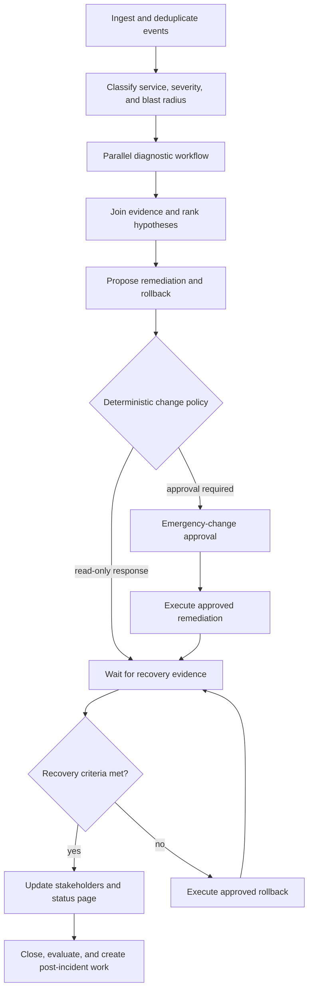

# Worked example — IT incident response

> **Status: Worked example.** Operational procedures, thresholds, and change classes are illustrative.

## Why this scenario

ServiceNow publicly describes AI agents supporting incident resolution, request fulfillment, vulnerability remediation, and enterprise IT operations. Incident response is architecturally valuable because it combines continuous events, uncertain diagnosis, production tools, human authority, time pressure, and recovery. Source reviewed July 13, 2026: [ServiceNow AI Agents](https://www.servicenow.com/products/ai-agents.html).

## Business outcome

For a production checkout-service incident, the system must:

```text
correlate alerts and customer-impact evidence
identify the affected service and accountable owner
run safe diagnostics in parallel
propose a bounded remediation and rollback plan
obtain required emergency-change authorization
execute exactly the approved change
verify recovery or roll back
maintain communications, audit, usage, and post-incident evidence
```

The model can form hypotheses and summarize evidence. Deterministic policy and authorized operators control production mutations.

## Non-goals

- Alert text is not trusted authority.
- The agent cannot grant itself production access.
- A plausible root-cause explanation does not authorize a change.
- A dashboard improvement does not alone prove customer recovery.
- The agent does not rewrite historical incident evidence after the event.

## Applicable ARA modules

```text
ARA Core
ARA Durable
ARA Enterprise Operations
ARA Multi-Tenant when the operations platform serves several organizations
ARA High-Assurance for production changes and security-sensitive systems
```

## Bounded contexts and resources

| Context | Owns |
|---|---|
| Service catalog | Service, owner, dependencies, tier, runbooks |
| Incident management | Incident lifecycle, severity, commander, timeline, communications |
| Observability | Alerts, metrics, logs, traces, deployment and topology signals |
| Change management | Change class, approval, maintenance/emergency policy, rollback |
| Runtime platform | Agent/workflow execution, effects, invocations, journal, budgets |
| Evaluation | Incident datasets, simulations, trajectory and recovery checks |

```text
AgentVersion: incident-response-agent@5.0.0
WorkflowVersion: production-incident-response@4.2.0
PolicyVersions:
  production-diagnostics@6.1.0
  emergency-change@9.0.0
  customer-communications@3.4.0
ToolVersions:
  observability.query@4.0.0
  deployment.read@3.2.0
  feature-flag.set@5.1.0
  rollout.status@2.3.0
  incident.update@4.1.0
```

## Workflow



The diagnostic section is a referenced workflow because it has parallel branches, joins, independent tool budgets, and its own completion policy.

## Diagnostic branches

```text
ExecutionBranch: recent deployment and configuration changes
ExecutionBranch: dependency and infrastructure health
ExecutionBranch: application metrics, logs, and traces
ExecutionBranch: customer-impact and synthetic transaction evidence
ExecutionBranch: known-issue and runbook retrieval
```

Branches receive immutable input snapshots and cannot mutate shared incident state. A deterministic join activity validates evidence, timestamps, service identity, and conflicts before model synthesis.

## Activity and effect map

| Activity | Deterministic work | Possible effects |
|---|---|---|
| Ingest | Authenticate sender, deduplicate, correlate, validate schema | External-event inbox and incident read/create |
| Classify | Map service tier and severity policy | Model classification when ambiguity remains |
| Diagnose | Enforce read-only scope and query budgets | Metrics, logs, traces, CMDB, deployment, and knowledge reads |
| Join | Validate timestamps, provenance, missing evidence | None |
| Propose | Validate structured action and rollback plan | Model generation |
| Gate | Apply change class, blast radius, freeze, and approver rules | Policy decision |
| Approve | Normalize exact production action | Human approval request and wait |
| Execute | Check grant, digest, current state, and idempotency | Feature flag, rollout, or orchestration mutation |
| Observe | Evaluate recovery window and criteria | Durable timer and observability reads |
| Rollback | Validate rollback target and authority | Reversal or compensation effect |
| Communicate | Apply disclosure and recipient policy | Incident/status communication |
| Review | Validate terminal incident record | Evaluation and post-incident task creation |

## Sequence: change execution and recovery

```mermaid
sequenceDiagram
    participant Monitor
    participant Runtime
    participant Journal
    participant Diagnostics
    participant Policy
    participant Commander
    participant ControlPlane
    participant Evaluation

    Monitor->>Runtime: Signed alert/event
    Runtime->>Journal: inbox accepted and incident run started
    Runtime->>Diagnostics: Start parallel read-only branches
    Diagnostics-->>Runtime: Provenanced evidence bundle
    Runtime->>Policy: Evaluate proposed feature-flag rollback
    Policy-->>Runtime: Emergency approval required
    Runtime->>Journal: approval.requested for exact action digest
    Commander->>Runtime: Approve action and rollback plan
    Runtime->>Journal: effect.planned before dispatch
    Runtime->>ControlPlane: Invocation 1 — set flag to safe configuration
    ControlPlane-->>Runtime: Operation accepted; asynchronous reference
    Runtime->>ControlPlane: Invocation 2 — poll operation status
    ControlPlane-->>Runtime: Succeeded
    Runtime->>Journal: effect.completed
    Runtime->>Runtime: Durable recovery-observation wait
    Runtime->>Diagnostics: Query customer and service recovery evidence
    Diagnostics-->>Runtime: Recovery criteria passed
    Runtime->>Journal: incident stabilized and workflow completed
    Journal-->>Evaluation: Timeline, effects, approvals, evidence, and costs
```

A timeout after an asynchronous change is treated as an unknown effect outcome and reconciled by operation reference before any retry.

## Production-change authority

A capability grant is constrained by:

```text
service and environment
specific operation and resource
approved argument digest
change class and incident ID
maximum blast radius
region and network destination
expiry and delegation depth
rollback target
budget and deadline
```

The approval view is generated from the exact action schema, current service state, predicted impact, rollback plan, evidence references, and policy reasons. Agent-written persuasion is displayed separately as untrusted commentary.

## State and evidence

```text
Incident
    business/operational lifecycle and accountable roles

WorkflowRun
    control state for this response execution

Alert/Event inbox
    authenticated, deduplicated external inputs

EvidenceBundle
    metrics, logs, traces, deployment, topology, customer signals

Effect and Invocation records
    diagnostics, change, poll, rollback, and communication operations

Run Journal and audit
    canonical execution and authorization facts

Artifacts
    hypothesis set, action plan, recovery evidence, post-incident report
```

A week-long incident should not be one monolithic trace. Use separate traces per workflow/child run, shared incident and execution-plan IDs, span links, and artifact lineage.

## Recovery and rollback semantics

- **Operational resume:** another worker continues the same run under a newer `WorkerLease`.
- **Effect reconciliation:** query the production control plane by operation or idempotency reference.
- **Rollback:** a separately authorized compensation effect; it does not erase the original change.
- **Counterfactual rerun:** a new simulation run against historical incident inputs; it cannot mutate production.
- **Evidence replay:** reconstruct the original run state with recorded outcomes and no external calls.

## Evaluation contract

Deterministic and environment assertions:

```text
alert sender and service mapping are valid
no diagnostic exceeded read-only scope
production action equals approved digest
stale worker cannot commit after lease transfer
exactly one effective change exists for the semantic effect key
recovery criteria use both service and customer signals
communications match current incident state
mandatory timeline and audit records are complete
```

Semantic and trajectory metrics:

```text
hypothesis quality and evidence coverage
root-cause ranking calibration
tool-query relevance and efficiency
remediation/rollback plan completeness
unsupported causal claims
appropriate escalation and stop behavior
```

Operational metrics:

```text
time to acknowledge, diagnose, authorize, mitigate, and recover
false remediation rate
rollback rate
unknown-outcome reconciliation time
operator intervention count
cost per resolved incident
rate-limit and capacity wait
post-incident action quality
```

## Failure-injection cases

1. Duplicate and out-of-order alerts.
2. Alert payload contains prompt injection.
3. CMDB owner or dependency data is stale.
4. Two workers race after a lease transfer.
5. Production change response is lost after acceptance.
6. Approval expires while evidence changes.
7. Proposed action exceeds the grant’s blast radius.
8. Observability provider is partially unavailable.
9. Model route is withdrawn during diagnosis.
10. Region fails while a change is in progress.
11. Customer metrics recover while server error rate remains high, or vice versa.
12. Rollback itself returns an ambiguous outcome.

## What this example teaches

- Incident response is event-driven durable coordination, not a single autonomous agent loop.
- Diagnostics and production changes need different capability classes.
- Recovery criteria, change authority, and rollback are deterministic contracts.
- The Run Journal, incident record, telemetry, audit, and post-incident artifacts serve different purposes.
