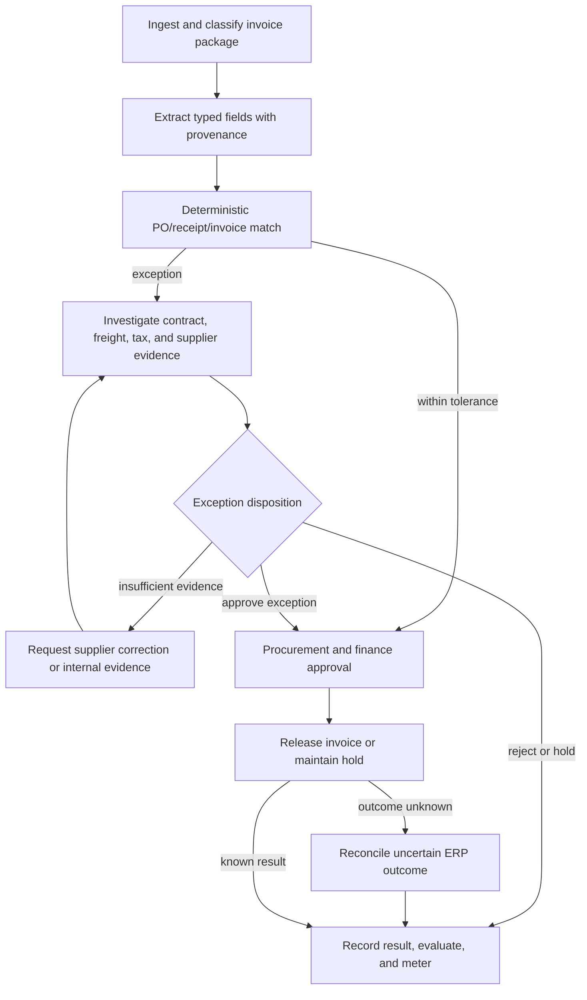

# Worked example — procure-to-pay exception resolution

> **Status: Worked example.** Accounting, tax, payment, and segregation-of-duties rules are illustrative and require domain review.

## Why this scenario

Enterprise platforms publicly target accounts-payable, sourcing, buying, supplier, receivables, cash, and procurement-contract workflows with AI assistants and agents. Sources reviewed July 13, 2026: [ServiceNow AI Agents](https://www.servicenow.com/products/ai-agents.html) and [SAP Joule Assistants](https://www.sap.com/products/artificial-intelligence/ai-assistant.html).

The scenario is valuable because it combines unstructured documents with deterministic accounting, supplier and fraud controls, dual approval, and an exact system-of-record mutation.

## Business outcome

Resolve invoice `INV-492` for supplier `V-77` against purchase order `PO-8841`, goods receipt `GR-221`, and contract `C-882`:

```text
extract and validate source documents
perform deterministic three-way match
investigate a freight and tax exception
verify supplier and bank-change risk
obtain required procurement and finance decisions
release exactly one approved invoice for payment
preserve complete financial, policy, and lineage evidence
```

## Non-goals

- The model does not perform authoritative arithmetic.
- A generated explanation cannot override contract, tax, or segregation-of-duties policy.
- Supplier bank details are never changed from an invoice or email alone.
- Payment release is not retried blindly after an uncertain ERP response.
- The example does not define jurisdiction-specific accounting treatment.

## Applicable ARA modules

```text
ARA Core
ARA Durable
ARA Enterprise Operations
ARA Multi-Tenant for a shared finance platform
ARA High-Assurance for financially material actions
ARA Regulated where retention, audit, or sector rules require it
```

## Bounded contexts and resources

| Context | Owns |
|---|---|
| Procurement | Contract, requisition, purchase order, category and buyer authority |
| Receiving | Goods/service receipt and acceptance evidence |
| Accounts payable | Invoice lifecycle, match result, holds, release and payment status |
| Supplier management | Supplier identity, bank-change workflow, sanctions/fraud flags |
| Tax | Tax rules, determination and review |
| Policy and approval | Segregation of duties, amount/risk thresholds, action binding |
| Artifacts and lineage | Source documents, extraction, normalized comparison and evidence |

```text
AgentVersion: procure-to-pay-exception-agent@4.0.0
WorkflowVersion: invoice-exception-resolution@5.0.0
PolicyVersions:
  three-way-match@6.2.0
  supplier-bank-change@8.0.0
  invoice-release-approval@7.1.0
ToolVersions:
  document.extract@3.4.0
  contract.read@2.2.0
  purchase-order.read@5.0.0
  receipt.read@3.1.0
  supplier-risk.read@4.0.0
  invoice.release@6.0.0
  invoice.status-by-idempotency-key@2.0.0
```

## Workflow



## Deterministic versus agentic work

| Work | Owner |
|---|---|
| Document classification and field proposal | Model effect plus schema validation |
| Decimal arithmetic, currency, tax and tolerance | Deterministic domain service |
| Contract-clause identification and explanation | Model effect grounded in exact source spans |
| Supplier identity and bank-change status | Supplier system and deterministic policy |
| Exception recommendation | Bounded agent activity |
| Approval requirement and eligible approvers | Policy and identity systems |
| Invoice release or hold | ERP tool effect after authorization |
| Final accounting status | ERP/accounts-payable domain |

## Activity and effect map

| Activity | Deterministic work | Possible effects |
|---|---|---|
| Ingest | Validate tenant, supplier, file type, malware and duplicates | Artifact writes and document-store reads |
| Extract | Validate required fields and source offsets | OCR/document model invocation |
| Match | Decimal arithmetic, quantities, currency and tolerance | PO, receipt and invoice reads |
| Investigate | Validate evidence scope and provenance | Contract, supplier, tax, sanctions, email/task reads; model synthesis |
| Request evidence | Select approved template and recipient | Supplier portal task or internal request |
| Approve | Normalize exact exception and release action | Human approval request and wait |
| Release | Revalidate invoice, hold, supplier and action digest | ERP invoice-release mutation |
| Reconcile | Apply provider-specific status rules | ERP status query by idempotency key |
| Complete | Validate terminal disposition and ledger consistency | Evaluation, audit and usage writes |

## Example exception

```text
Invoice subtotal:                 EUR 178,500.00
Freight surcharge:                EUR   1,500.00
Invoice total before tax:         EUR 180,000.00
PO authorized amount:             EUR 180,000.00
Receipt accepted amount:          EUR 178,500.00
Contract freight clause:          buyer pays documented emergency freight
Evidence:                         carrier invoice and buyer authorization present
Supplier bank-change request:     pending separate verification; not used for this payment
```

The model locates and summarizes the freight clause. Deterministic code verifies decimal totals, currency, quantities, tolerance, and required evidence.

## Approval binding

The release approval binds:

```text
tenant and legal entity
invoice, supplier, PO, receipt and contract references
normalized exception and evidence digests
release amount and currency
current supplier/payment-instruction version
policy versions
approver identities and roles
expected invoice and run versions
expiry
```

The procurement approver accepts the commercial exception. The finance controller accepts accounting and release treatment. Neither can satisfy the other role where segregation of duties applies.

## Ambiguous ERP mutation

```mermaid
sequenceDiagram
    participant Runtime
    participant Policy
    participant Approvers
    participant Journal
    participant ERP
    participant Audit
    participant Evaluation

    Runtime->>Policy: Evaluate invoice-release Effect
    Policy-->>Runtime: Dual approval required
    Runtime->>Journal: approval.requested for normalized digest
    Approvers->>Runtime: Procurement and finance decisions
    Runtime->>Runtime: Revalidate invoice, supplier, bank instruction, and budget
    Runtime->>Journal: effect.planned with semantic effect key
    Runtime->>ERP: Invocation 1 — release invoice
    ERP--xRuntime: Response lost after transaction may have committed
    Runtime->>Journal: effect.outcome_unknown
    Runtime->>ERP: Invocation 2 — query release status by idempotency key
    ERP-->>Runtime: Invoice released once; payment batch reference returned
    Runtime->>Journal: effect.reconciled and workflow completed
    Journal-->>Audit: Financial and authorization evidence
    Journal-->>Evaluation: Trajectory and outcome evidence
```

The runtime keeps one logical release `Effect`. A second create/release invocation is prohibited until reconciliation shows the original operation did not occur and retry is safe.

## State and artifact model

```text
InvoiceCase
    authoritative business lifecycle and disposition

WorkflowRun
    control state, pending activities, effects, approvals and budgets

InputSnapshot
    exact document and system-record versions used by an ActivityRun

Artifacts
    original invoice, normalized extraction, match report,
    contract evidence, approval view, release result, evaluation bundle

MemoryRecord
    optional governed reusable supplier/process knowledge;
    never authoritative invoice or bank state

Run Journal, audit and usage
    execution, authorization, financial and cost evidence
```

## Security and data governance

- Invoice and email content are untrusted and may contain prompt injection.
- Supplier bank changes use a separate verified workflow and cannot be inferred from invoice text.
- Entity, tenant, legal-company, region, retention, and classification scope travel through every protected boundary.
- Model and document services receive only the minimum required content under declared retention policy.
- ERP credentials are purpose-bound and injected at invocation dispatch.
- Approval and release interfaces display deterministic normalized data, not only an agent summary.
- Exported telemetry uses protected references and pseudonymous identifiers where raw business IDs are unnecessary.

## Evaluation contract

Deterministic assertions:

```text
all decimal arithmetic is exact
invoice, PO, receipt, supplier and legal entity match
source evidence spans exist for extracted and summarized claims
segregation of duties is satisfied
approved action digest equals released action digest
one effective invoice release exists for the semantic effect key
bank instructions were not changed through this workflow
mandatory audit and retention metadata are complete
```

Semantic and trajectory metrics:

```text
field-extraction correctness and provenance
contract-clause relevance and faithfulness
exception classification and evidence sufficiency
appropriate request, hold, reject, approve or escalate choice
tool choice and argument correctness
unsupported accounting or policy claims
```

Operational metrics:

```text
exception cycle time
straight-through and human-review rate
supplier correction loops
reconciliation time
release error and duplicate rate
cost per correctly resolved exception
manual rework and audit finding rate
```

## Failure-injection cases

1. Invoice contains malicious instructions in a description field.
2. OCR swaps decimal separators or currency.
3. PO or receipt changes after the input snapshot.
4. Supplier bank change is pending or fraudulent.
5. Contract evidence is missing or contradictory.
6. One required approver is also the requester.
7. Approval expires before release.
8. ERP response is lost after commit.
9. Duplicate supplier invoice arrives under another filename.
10. Data must be deleted while legal-hold evidence remains.
11. Control plane is unavailable during an open approval wait.
12. Backup restore attempts to resurrect a deleted protected payload.

## What this example teaches

- Agentic reasoning is useful for evidence gathering and exception analysis, while accounting and authority remain deterministic.
- Financial mutations require semantic effect identity, exact approval binding, idempotency or reconciliation, and independently protected audit.
- A document, workflow state, memory record, artifact and ERP record are distinct authorities.
