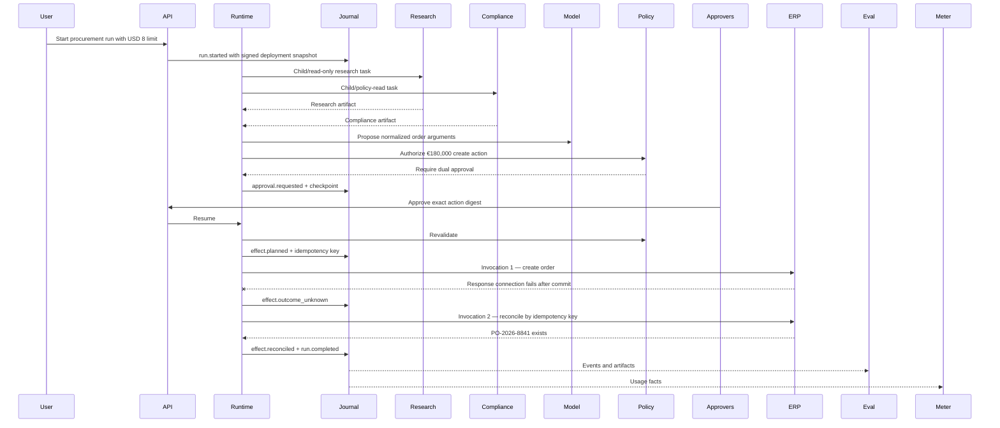

# Worked example — procurement agent

## Scenario

Acme EU asks the production agent to create a €180,000 purchase order from contract `C-882` and quote `Q-19` with an effective per-run cost limit of USD 8.00 under a USD 12.00 deployment ceiling.

Requirements:

- Read contract and vendor data in the EU region.
- Reconcile line items with model reasoning.
- Run independent research and compliance checks.
- Require procurement-manager and finance-controller approval.
- Create exactly one order despite an injected network timeout.
- Evaluate correctness and policy compliance.
- Attribute all cost and package usage.

## Architecture trace



## Ownership

| Operation | Owner | Evidence |
|---|---|---|
| Authenticate and route tenant | Application/identity | Auth audit and EU cell decision |
| Resolve behavior | Control plane | Deployment digest |
| Create and progress run | Execution context/runtime | Canonical run events |
| Compile context | Runtime | Source refs and digest |
| Delegate checks | Runtime/policy | Child run IDs and grants |
| Propose order | Model gateway | Normalized request/result and usage |
| Validate totals | Domain/task activity | Deterministic validation event |
| Approve | Approval service | Signed decisions bound to action digest |
| Create and reconcile | Tool gateway/runtime | One effect, two invocation attempts, provider evidence |
| Complete | Run aggregate | Terminal result and artifacts |
| Evaluate | Evaluation plane | Versioned evaluation result |
| Bill | Metering plane | Immutable usage records |

## Deterministic assertions

```text
vendor matches contract
total equals €180,000 and currency is EUR
every line item traces to contract or quote
both approvals precede tool dispatch
action digest equals executed argument digest
exactly one ERP order exists for the idempotency key
no cross-tenant or cross-region access occurred
effective USD 8 run budget was enforced
```

## Failure recovery

The timeout is classified `effectMayHaveOccurred=true` and `safeToRetry=false`. The runtime retains one logical create effect and performs a separate reconciliation invocation rather than sending another create request.

## Compensation boundary

The example demonstrates reconciliation, not rollback. If the domain permits cancelling a created order, that cancellation is a separately authorized compensation effect with its own audit and failure semantics. See [Saga and compensation](/patterns/saga-and-compensation).
