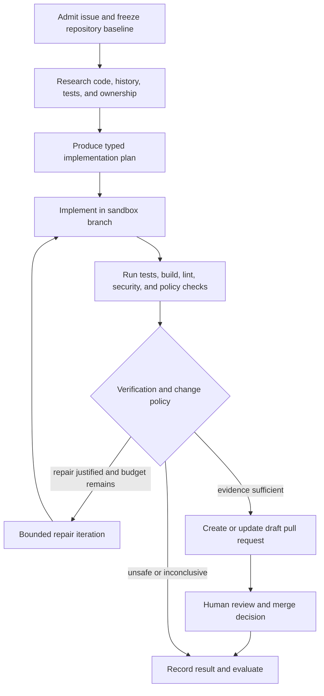
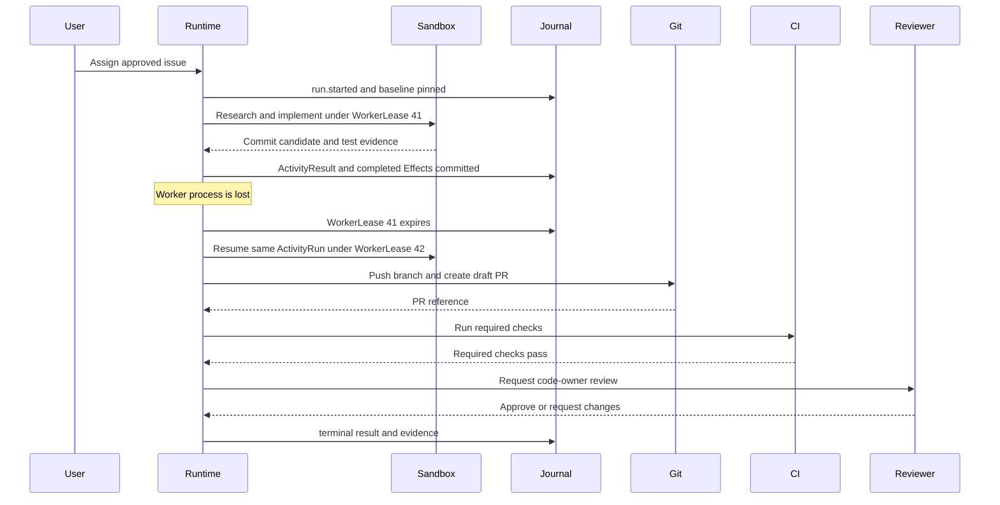

# Worked example — software change delivery

> **Status: Worked example.** Repository, CI, licensing, and change-management policies are illustrative.

## Why this scenario

GitHub documents that its cloud coding agent can research repositories, plan changes, fix bugs, implement incremental features, improve test coverage, update documentation, address technical debt, resolve merge conflicts, and execute in an ephemeral development environment. Source reviewed July 13, 2026: [About GitHub Copilot cloud agent](https://docs.github.com/en/copilot/concepts/agents/cloud-agent/about-cloud-agent).

OpenAI and Anthropic separately document sandbox, permission, and approval controls for coding agents. These public designs support the ARA rule that operating-environment authority is separate from prompt instructions.

## Business outcome

Given an approved issue, produce a reviewable draft pull request that:

```text
implements the requested bounded change
passes required tests, lint, build, and security checks
contains attributable commits and a clear change summary
changes no undeclared repository or external system
requires an authorized human to merge or deploy
```

## Non-goals

- The agent does not merge directly to a protected branch.
- Passing tests do not prove semantic correctness or security.
- Repository instructions do not grant credentials or network access.
- The model does not decide production change authorization.
- The sandbox does not receive broad organization secrets.

## Applicable ARA modules

```text
ARA Core
ARA Durable for background sessions and recovery
ARA Enterprise Operations for shared runners, policy, audit, and provider lifecycle
ARA Multi-Tenant when several organizations or business units share the platform
ARA High-Assurance for security-sensitive repositories
```

## Bounded contexts and resources

| Context | Owns |
|---|---|
| Work management | Issue, acceptance criteria, priority, owner, change class |
| Repository | Source, branch protection, code owners, commits, pull requests |
| Build and verification | Tests, CI, security scans, artifact attestations |
| Change management | Approval, deployment window, rollback target |
| Agent catalog | Coding-agent versions, skills, tools, policies, evaluation contracts |
| Sandbox | Ephemeral environment, filesystem, process, network, resource limits |

```text
AgentVersion: software-change-agent@4.0.0
WorkflowVersion: issue-to-draft-pr@3.1.0
SandboxProfileVersion: repository-build-sandbox@5.2.0
PolicyVersions:
  repository-change-policy@8.0.0
  dependency-and-license-policy@4.4.0
  outbound-network-policy@3.0.0
EvaluationSuiteVersion: software-change-release@7.1.0
```

## Workflow



The plan is a versioned artifact containing `PlanStep`s. Executable work remains activities and effects; a plan step is not automatically a runtime activity.

## Activity and effect map

| Activity | Deterministic work | Possible effects |
|---|---|---|
| Admit | Validate issue, repository, branch policy, scope, budget | Read issue and repository metadata |
| Research | Enforce allowed paths and content exclusions | Repository reads, code search, history reads, documentation retrieval |
| Plan | Validate plan schema, file scope, acceptance mapping | Model generation |
| Implement | Check sandbox image and capability grant | File edits, local commands, language tools, dependency resolution |
| Verify | Interpret exit codes and required checks | Tests, build, lint, SAST, dependency/license scan |
| Repair | Enforce iteration and no-progress limits | Model generation and sandbox commands |
| Draft PR | Validate diff, branch, commit signatures, required evidence | Push branch, create/update draft pull request |
| Human review | Enforce code-owner and change authority | Review request and approval wait |
| Complete | Verify terminal result and lineage | Evaluation start, evidence-artifact writes |

## Sandbox and capability boundary

```text
read/write:
  one repository worktree and agent branch

network:
  denied by default
  allow package registries only through declared proxy

secrets:
  purpose-bound short-lived credential for branch/PR operation
  no production credentials

process:
  bounded CPU, memory, disk, wall time, and child processes

artifacts:
  diff, test logs, scan reports, build outputs, provenance
```

A dependency addition or network expansion creates a policy decision and may require human approval. The agent cannot authorize its own capability expansion.

## Durable recovery sequence



Worker loss creates a new `WorkerLease`, not a new `ActivityAttempt`, because committed repository and test effects are reused. A complete activity restart is used only when the declared boundary genuinely requires it.

## Iteration and no-progress policy

A repair cycle is an `Iteration` because it consumes updated test or review evidence.

```yaml
maximumIterations: 3
stopWhen:
  any:
    - requiredChecksPassed: true
    - repeatedDiffDigest: 2
    - noProgressIterations: 2
    - remainingCostBelow: "1.00 USD"
```

A materially changed objective, repository baseline, dependency policy, or model route creates a new run or effect as appropriate; it is not hidden inside a retry.

## State and evidence

```text
IssueSnapshot
RepositoryBaseline
PlanArtifact
ContextSnapshot per model Effect
DiffArtifact and commit references
SandboxExecution evidence
Test/build/lint/security reports
DraftPullRequestRef
ReviewDecision
Run Journal, audit, usage, and EvaluationResult
```

Generated code and test output are artifacts with producer, digest, repository baseline, model/tool versions, sandbox image, and lineage.

## Security and authority

- Repository scope and content exclusions are deterministic.
- Untrusted source files, issues, comments, and dependency metadata can contain indirect prompt injection.
- Tool descriptions and repository instructions are versioned and reviewed.
- Network egress is denied by default.
- Credentials are injected by purpose at dispatch and never placed in prompts or run state.
- Protected-branch merge and production deployment remain human or deterministic change-management decisions.
- Generated shell commands run only in the sandbox; fixed APIs are preferred for repository operations.
- Pull-request text is treated as untrusted content when rendered or consumed by downstream automation.

## Evaluation contract

Deterministic and environment verification:

```text
acceptance tests pass
required build and lint pass
no undeclared file or repository changed
no forbidden network or secret access occurred
branch derives from pinned baseline
commit and PR lineage is complete
required code-owner review occurred before merge
```

Semantic and trajectory evaluation:

```text
plan covers acceptance criteria
change is minimal and maintainable
tests exercise changed behavior
tool selection and command arguments are correct
repair iterations respond to evidence rather than repeat actions
PR summary accurately describes the diff and residual risk
```

Operational metrics:

```text
time to reviewable PR
human rework and rejection rate
CI pass rate on first submission
security finding rate
iteration and repeated-diff count
cost per accepted change
sandbox queue and execution time
```

Hard gates include unauthorized repository access, secret exposure, forbidden egress, bypassed review, unsafe dependency, unverified generated code, and incomplete audit.

## Failure-injection cases

1. Issue text contains instructions to exfiltrate secrets.
2. Repository file attempts to override agent policy.
3. Dependency install requests an undeclared registry.
4. Worker dies after a successful test run and committed activity result.
5. CI callback is duplicated or arrives after cancellation.
6. Model produces the same failing diff twice.
7. Required reviewer is unavailable.
8. Branch baseline changes before PR creation.
9. Sandbox process attempts host or network escape.
10. Provider model is withdrawn during a multi-hour session.

## What this example teaches

- A coding agent is a durable, sandboxed change workflow—not a special exception to platform architecture.
- Commits, tests, scans, and review decisions are execution evidence.
- Human review owns merge authority; the agent owns neither branch protection nor deployment policy.
- Recovery reuses committed effects and artifacts instead of repeating work blindly.
