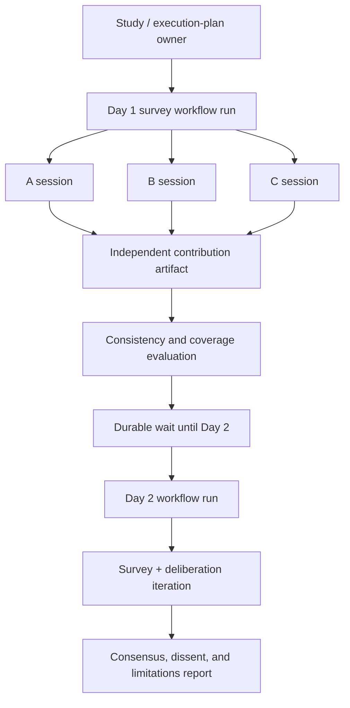

# Worked example — synthetic research panel

## Scenario

A product-research application simulates three persistent participants A, B, and C. Day 1 collects independent opinions. Day 2 presents new evidence, conducts a bounded deliberation, and asks each participant to update or preserve its position.

This is a simulation system, not a substitute for validated human-subject research.

## Domain model

```text
Study
  Cohort
  ParticipantDefinition and Version
  ParticipantInstance A/B/C
    ParticipantStateVersions
    scoped MemoryRecords
    ParticipantSessions
    Contributions
  Deliberation
  ResearchReport
```

## Execution model



## Participant continuity

Participant A in Day 2 is reconstructed from:

```yaml
participantId: participant-A-017
personaVersion: budget-conscious-urban-student@1.2.0
participantStateVersion: 2
memorySelection:
  scope: participant-A-017
  include:
    - prior_preferences
    - prior_commitments
    - unresolved_concerns
currentStudyInput:
  evidenceArtifact: artifact://sha256/day2-evidence
  questionSet: follow-up@2.0.0
```

A persistent participant is not a persistent model process. Continuity is explicit identity, state, memory, and provenance.

## Day 1

A, B, and C receive the same question/evidence snapshot but cannot see one another’s private answers. Each session may be a model activity or agent activity. Contributions are immutable artifacts.

After each response:

```text
extract proposed beliefs/preferences/commitments
-> validate provenance and contradictions
-> create new ParticipantStateVersion
-> write participant-scoped memory records
```

## Day 2 deliberation

```text
private updated survey
-> normalize positions
-> identify agreement and contradictions
-> share only permitted contribution bundle
-> targeted challenges/rebuttals
-> verify disputed claims
-> synthesize consensus and dissent
-> evaluate whether another iteration is justified
```

`Round` is the domain label; `IterationRun` executing a body workflow is the runtime model.

## Isolation

- A cannot retrieve B or C private memory.
- Shared study evidence is a separate scope.
- Deliberation transcript is a separate attributed or anonymized artifact.
- Tenant and study IDs are mandatory in every memory lookup.

## Evaluation

Hard checks:

- No cross-participant memory access.
- Stable persona version and state input.
- Prior explicit commitments are represented or intentionally revised.
- Position changes cite new evidence.

Soft/empirical checks:

- Longitudinal consistency.
- Justification of opinion change.
- Persona adherence without stereotype amplification.
- Diversity and model-route sensitivity.
- Agreement with real human validation samples.

## Limitations

LLMs do not constitute statistically representative people. Demographic labels can amplify stereotypes. Results must disclose models, persona construction, validation method, uncertainty, and the fact that participants are synthetic.
