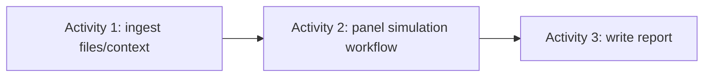

# Worked example — synthetic research panel

## Scenario

A product-research application simulates three persistent participants A, B, and C against an uploaded evidence bundle. It compares two simulation configurations:

```text
Variant A: participant model A + deliberation model A
Variant B: participant model B + deliberation model B
```

This is a simulation system, not a substitute for validated human-subject research.

## Top-level workflow



Activity 2 is a referenced workflow because it has internal dependencies, parallelism, budgets, evaluation, and rate-limit waits.

## Domain model

```text
Study
  SyntheticParticipantPanel
    ParticipantInstance A/B/C
      PersonaVersion
      ParticipantStateVersions
      scoped MemoryRecords
      ParticipantSessions
  SimulationExperiment
  ResearchReport
```

`Panel` is a domain term for the stable group of participants. The reference-architecture core does not define a `PanelSimulationWorkflow` type; the research bounded context names a generic workflow for its domain.

## Execution model

```text
AgenticResearchWorkflowRun
├── ActivityRun: ingest-context -> ContextBundle artifact
├── WorkflowRun: simulate-panel
│   ├── ExecutionBranch: Variant A
│   │   ├── TrialRuns from frozen baseline
│   │   ├── parallel ParticipantSession ActivityRuns
│   │   ├── DeliberationRound domain views -> IterationRuns
│   │   └── VariantEvaluation
│   ├── ExecutionBranch: Variant B
│   └── ActivityRun: compare-variants
└── ActivityRun: write-report
```

Model A and Model B are variants, not rounds. Repeated independent executions are trials. A sequential discussion cycle is an iteration, optionally presented as a `DeliberationRound`. A provider 429 retry is an `InvocationAttempt` for the same model effect.

## Participant continuity and experimental isolation

Both variants consume the same frozen participant baseline:

```yaml
participantId: participant-A-017
personaVersion: budget-conscious-urban-student@1.2.0
baselineStateVersion: 2
baselineMemorySnapshot: memory-snapshot-A@8
contextBundle: artifact://sha256/study-context
```

Each variant writes to an isolated branch:

```text
Participant A baseline
├── Variant A state/memory branch
└── Variant B state/memory branch
```

Variant A must not modify the baseline seen by Variant B. A longitudinal study that intentionally passes A’s updated state into B is an iteration and answers a different question.

## Participant survey and deliberation

Within each variant:

```text
private independent survey A/B/C
-> validate and collect immutable contributions
-> identify agreement and contradictions
-> create permitted shared evidence bundle
-> targeted challenges/rebuttals
-> verify disputed claims
-> synthesize consensus, dissent, and uncertainty
-> evaluate whether another deliberation iteration is justified
```

Private memories are not shared. Peer contributions remain untrusted inputs and are schema/provenance validated before use.

## Logical parallelism and physical throttling

Variants and participant sessions are logically parallelizable. The model gateway controls physical concurrency by provider account, model, tenant, region, requests-per-minute, tokens-per-minute, concurrent calls, deadline, and budget.

```text
runnable model effects
-> provider/model capacity queue
-> reserve request/token/concurrency permit
-> invoke
-> reconcile actual usage
```

A rate limit creates a durable capacity wait or invocation retry; it is not a new trial. For rigorous comparisons, use balanced interleaving or phase barriers so one variant is not systematically favored by scheduling time.

## Evaluation

Participant level:
- Persona and longitudinal consistency.
- Memory and evidence correctness.
- Stereotype amplification and cross-participant leakage.

Deliberation level:
- Contradiction detection, evidence use, justified opinion change, minority-view preservation, groupthink.

Variant/trial level:
- Task quality, variance, failure rate, cost, duration, rate-limit wait, hard gates.

Cross-variant level:
- Model sensitivity, agreement/disagreement, quality/cost frontier, robustness across trials.

## Limitations

LLMs do not constitute statistically representative people. Results must disclose models, persona construction, trial count, validation method, uncertainty, scheduling/budget treatment, and the fact that participants are synthetic.
