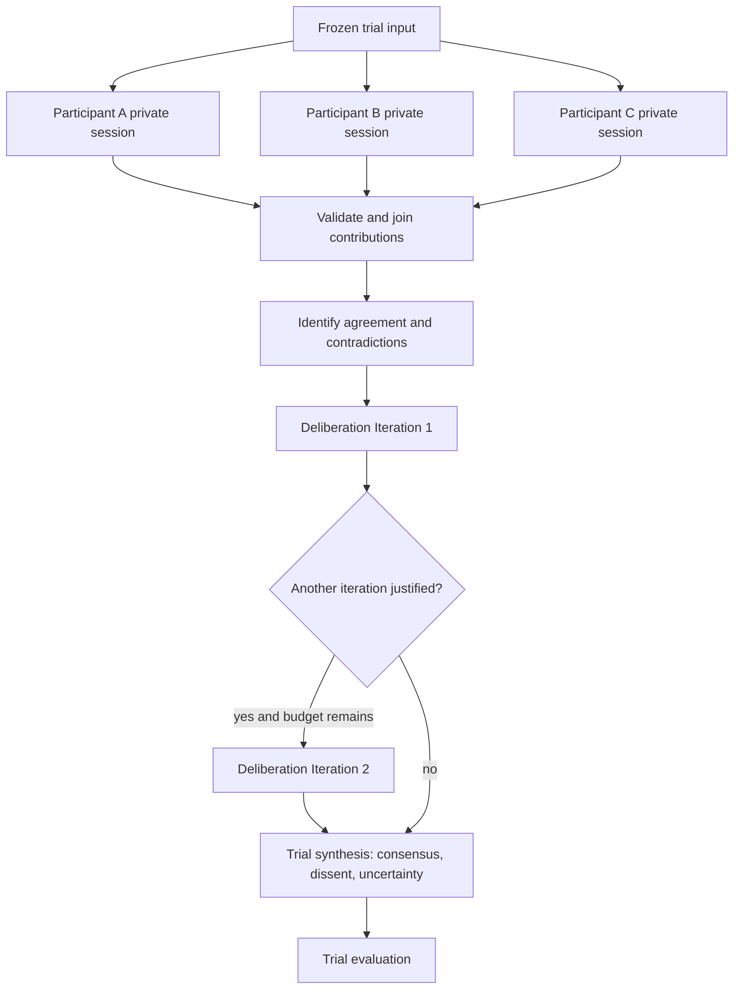

# Worked example — synthetic research experiment

> **Status: Worked example.** Synthetic participants are research-domain extensions, not ARA core types and not substitutes for representative human-subject research.

## Why this scenario

The scenario exercises architecture that ordinary business workflows do not: persistent simulated identities, controlled model variants, independent repetitions, deliberation, scheduling fairness, and statistical uncertainty. It is informed by public research on generative agents, self-consistency, and multi-agent debate, while ARA adds production concerns such as tenant isolation, durable execution, budgets, provenance, and evaluation.

## Business outcome

Given an immutable evidence bundle and three synthetic participant definitions, compare two simulation configurations and produce a report that preserves:

```text
individual positions
supporting evidence and confidence
changes during deliberation
consensus, dissent, and unresolved uncertainty
model/configuration sensitivity
trial-level variance, cost, latency, and failure evidence
```

A research owner approves any external claim or publication. The system does not claim that synthetic participants represent a population.

## Non-goals

- Simulated participants are not human respondents.
- Persona prompts do not establish demographic validity.
- One trial does not establish a reliable result.
- Deliberation is not forced to reach consensus.
- Variant B must not inherit hidden state from Variant A in an independent comparison.

## Applicable ARA modules

```text
ARA Core
ARA Durable
ARA Enterprise Operations for shared capacity, model lifecycle, and evidence
ARA Multi-Tenant when several research teams share the platform
ARA High-Assurance when results influence material decisions
```

## Domain extensions and ARA mapping

| Research-domain concept | ARA mechanism |
|---|---|
| `Study` | `ExecutionPlanRun` coordinating ingestion, experiments, report and review |
| `SyntheticParticipant` | Stable domain identity |
| `PersonaVersion` | Immutable participant behavior input |
| `ParticipantStateVersion` | Immutable longitudinal domain state |
| `ParticipantSession` | `ActivityRun` or child `AgentRun` |
| Contribution | Immutable `Artifact` |
| Deliberation cycle | Qualified `DeliberationRound` mapped to `Iteration` |
| Model/configuration comparison | `ExperimentRun` and `ExperimentVariant` |
| Independent repetition | `ExperimentTrial` referencing an execution subject |
| Study report | Artifact plus evaluation and approval evidence |

## Top-level workflow


The simulation is a referenced child workflow because it has parallel branches, repeated trials, durable capacity waits, joins, budgets, and its own evaluation lifecycle.

## Experiment structure

```text
ExperimentRun: compare simulation configurations
├── ExperimentVariant A
│   participantModelRoute: model-a@3
│   deliberationModelRoute: model-a@3
│   ├── ExperimentTrial A1 -> WorkflowRun
│   ├── ExperimentTrial A2 -> WorkflowRun
│   └── ExperimentTrial A3 -> WorkflowRun
└── ExperimentVariant B
    participantModelRoute: model-b@2
    deliberationModelRoute: model-b@2
    ├── ExperimentTrial B1 -> WorkflowRun
    ├── ExperimentTrial B2 -> WorkflowRun
    └── ExperimentTrial B3 -> WorkflowRun
```

Model A and Model B are **variants**, not rounds. A repeated independent execution from the same frozen baseline is an `ExperimentTrial`. A sequential discussion cycle using updated evidence is an `Iteration`. A provider retry is another `Invocation` of the same model `Effect`.

## Participant continuity and isolation

```yaml
participantId: participant-A-017
personaVersion: budget-conscious-urban-student@1.2.0
participantStateVersion: 2
baselineMemorySnapshotRef: memory_snapshot_A_08
contextBundleRef: artifact_context_01
```

Each trial receives the same frozen baseline unless the study explicitly tests longitudinal change:

```text
Participant A baseline
├── Variant A / Trial A1 state branch
├── Variant A / Trial A2 state branch
├── Variant A / Trial A3 state branch
├── Variant B / Trial B1 state branch
├── Variant B / Trial B2 state branch
└── Variant B / Trial B3 state branch
```

A branch cannot mutate the baseline or another branch. Longitudinal continuation uses a new `ParticipantStateVersion` and a later iteration or workflow run; it answers a different question from an independent model comparison.

## One trial



Initial participant responses are private. Shared deliberation content is constructed as a governed artifact containing only permitted contributions and evidence. Private memory does not become group context.

## Activity and effect map

| Activity | Deterministic work | Possible effects |
|---|---|---|
| Ingest | Malware, schema, classification, provenance and duplicate checks | Artifact and document-processing effects |
| Freeze baseline | Resolve exact versions and snapshots | Memory/artifact reads |
| Participant session | Validate persona, question and output schema | Model effects, governed memory reads, optional read-only tools |
| Join | Validate trial, participant, provenance and contribution contracts | None |
| Analyze | Compute deterministic coverage and contradiction candidates | Model analysis effect when semantic judgment is needed |
| Deliberate | Enforce visibility, iteration, budget and stop policy | Model effects and read-only verification tools |
| Synthesize | Preserve minority views and source references | Model generation effect |
| Evaluate | Apply deterministic, semantic, bias and operational evaluators | Evaluation effects |
| Compare | Validate trial inclusion and statistical method | Aggregation and optional judge effects |
| Report/review | Apply disclosure and publication policy | Report artifact, approval request, external publication effect |

## Logical parallelism and physical capacity

Trials and participant sessions may be logically runnable together. The scheduler and model gateway control physical execution using:

```text
provider account and model route
region and tenant
requests per minute and tokens per minute
concurrent invocations
reserved experiment capacity
fairness and priority
trial deadline and budget
cache and fallback policy
```

```text
runnable model Effects
-> capacity reservation
-> Invocation
-> provider response or rate-limit evidence
-> durable wait when capacity is unavailable
-> later Invocation for the same Effect
-> usage reconciliation
```

A rate limit does not create a new trial. For controlled comparisons, use randomized or balanced interleaving, equal budgets, declared cache policy, and either independent progress or an explicit phase barrier.

## Trial and iteration policy

```yaml
trialsPerVariant: 3
trialReplacement:
  infrastructureFailure: preserve_and_replace
  subjectBehaviorFailure: preserve_do_not_replace

deliberation:
  maximumIterations: 2
  continueWhen:
    unresolvedCriticalContradictionsGreaterThan: 0
    minimumEvidenceCoverageNotMet: true
  stopWhen:
    repeatedContributionDigest: 2
    noMaterialChangeIterations: 1
```

Excluded or replacement trials remain in evidence with reason, owner, and effect on analysis.

## State and evidence

```text
Study and participant state
    research-domain authority

Workflow and experiment state
    execution control, variant/trial assignment, inclusion and status

ContextSnapshot
    exact evidence supplied to each model Effect

MemoryRecord
    scoped, provenanced, revocable participant information

Artifacts
    contributions, shared evidence, deliberation, synthesis, report

Run Journal, telemetry, audit and usage
    execution, operations, authorization and cost evidence

EvaluationResult
    participant, deliberation, trial, variant and cross-variant judgments
```

## Evaluation contract

Participant level:

```text
persona and longitudinal consistency
evidence and memory correctness
cross-participant leakage
unsupported demographic inference
stereotype amplification
```

Deliberation level:

```text
contradiction detection
evidence use and source faithfulness
justified opinion change
minority-view preservation
groupthink and repeated-action detection
```

Trial and variant level:

```text
task completion and grounding
pass rate and failure distribution
variance and confidence/uncertainty
cost, latency and rate-limit wait
model sensitivity and quality/cost frontier
scheduler, cache and fallback treatment
```

Hard gates include cross-tenant leakage, forbidden source access, private-memory leakage, fabricated evidence, missing provenance, budget enforcement, and incomplete disclosure.

## Failure-injection cases

1. Uploaded evidence contains indirect prompt injection.
2. Two participants accidentally share the same memory scope.
3. Variant A state leaks into Variant B.
4. Provider rate limits one model route more heavily.
5. One trial fails from infrastructure after partial effects.
6. A participant produces a schema-valid but stereotyped response.
7. Deliberation suppresses a minority position.
8. Verification tool returns contradictory evidence.
9. Model fallback would invalidate the experiment.
10. Report omits synthetic-participant and trial limitations.

## Limitations and publication rule

Results disclose:

```text
synthetic nature of participants
persona construction and validation
models, prompts, tools and versions
baseline and memory policy
variants, number of trials and exclusions
scheduler, cache, fallback and budget treatment
evaluation method and uncertainty
known gaps relative to human research
```

The report cannot be represented as statistically representative human opinion without independent domain evidence and an explicitly different research design.

## What this example teaches

- Experiment trials belong outside the universal runtime hierarchy and reference their execution subjects.
- Persistent identity does not imply shared mutable state across variants.
- Deliberation rounds are domain-qualified iterations.
- Logical parallelism and physical provider concurrency are separate decisions.
- Evaluation validity is part of the architecture, not an afterthought.
