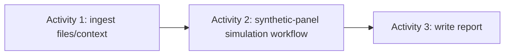

# Worked example — synthetic research panel

> **Status: Worked example.** It illustrates ARA semantics and does not make synthetic participants a core platform type.

## Scenario

A product-research application simulates three persistent participants A, B, and C against an uploaded evidence bundle. It compares two configurations:

```text
ExperimentVariant A: participant model A + deliberation model A
ExperimentVariant B: participant model B + deliberation model B
```

This is a simulation system, not a substitute for validated human-subject research.

## Top-level workflow



Activity 2 references a workflow because its internal work has dependencies, parallelism, budgets, evaluation, and durable capacity waits.

## Domain model

```text
Study
├── SyntheticParticipantPanel
│   └── ParticipantInstance A/B/C
│       ├── PersonaVersion
│       ├── ParticipantStateVersion
│       ├── scoped MemoryRecord
│       └── ParticipantSession
├── SimulationExperiment
│   ├── ExperimentVariant A
│   ├── ExperimentVariant B
│   └── ExperimentTrial(s)
└── ResearchReport
```

`Panel`, `SimulationExperiment`, and `ParticipantInstance` are research-domain concepts. ARA supplies workflows, runs, activities, state, memory, artifacts, effects, invocations, and evaluation.

## Execution model

```text
AgenticResearch WorkflowRun
├── ActivityRun: ingest-context
│   └── ContextBundle Artifact
├── ActivityRun: simulate-panel
│   └── child WorkflowRun: panel-simulation
│       ├── ExperimentTrial A1 -> WorkflowRunRef
│       │   ├── ExecutionBranch: participant A session
│       │   ├── ExecutionBranch: participant B session
│       │   ├── ExecutionBranch: participant C session
│       │   ├── Iteration: deliberation cycle 1
│       │   └── EvaluationResult
│       ├── ExperimentTrial A2 -> WorkflowRunRef
│       ├── ExperimentTrial B1 -> WorkflowRunRef
│       ├── ExperimentTrial B2 -> WorkflowRunRef
│       └── ActivityRun: compare variants
└── ActivityRun: write-report
```

Model A and Model B are experiment variants, not rounds. Independent repetitions from a frozen baseline are `ExperimentTrial`s. A sequential discussion cycle is an `Iteration`, optionally presented to research users as a `DeliberationRound`. A provider 429 creates a later `Invocation` for the same model `Effect`.

## Participant continuity and experimental isolation

Every trial consumes the same frozen participant baseline unless the experiment explicitly studies longitudinal change:

```yaml
participantId: participant-A-017
personaVersion: budget-conscious-urban-student@1.2.0
baselineStateVersion: 2
baselineMemorySnapshot: memory-snapshot-A@8
contextBundle: artifact://sha256/study-context
```

Variant and trial state is isolated:

```text
Participant A frozen baseline
├── Variant A / Trial A1 branch
├── Variant A / Trial A2 branch
├── Variant B / Trial B1 branch
└── Variant B / Trial B2 branch
```

One branch must not modify the baseline observed by another. A longitudinal workflow that intentionally carries updated participant state forward uses an `Iteration` or a later `WorkflowRun` and answers a different question from an independent model comparison.

## Survey and deliberation inside one trial

```text
private independent survey A/B/C
-> validate and store immutable contributions
-> identify agreement and contradictions
-> create a permitted shared-evidence artifact
-> request targeted challenges and rebuttals
-> verify disputed claims
-> synthesize consensus, dissent, and uncertainty
-> evaluate whether another Iteration is justified
```

Private memories are not shared. Peer contributions remain untrusted inputs and are schema-, provenance-, tenant-, and classification-validated before use.

## Logical parallelism and physical throttling

Experiment trials and participant branches may be logically runnable together. The scheduler and model gateway control physical concurrency by provider account, model, tenant, region, requests per minute, tokens per minute, active invocations, deadline, fairness policy, and budget.

```text
runnable model Effects
-> provider/model capacity queue
-> reserve request/token/concurrency permit
-> create Invocation
-> reconcile actual usage
```

A rate limit causes a durable capacity wait and a later invocation; it is not another experiment trial. For rigorous comparisons, use balanced interleaving or phase barriers so time of day and capacity do not systematically favor a variant.

## Evaluation

Participant level:

- Persona and longitudinal consistency.
- Memory and evidence correctness.
- Stereotype amplification and cross-participant leakage.

Deliberation level:

- Contradiction detection, evidence use, justified change, minority-view preservation, and groupthink.

Experiment-trial level:

- Task quality, variance, failure rate, cost, duration, rate-limit wait, and hard gates.

Cross-variant level:

- Model sensitivity, agreement/disagreement, quality/cost frontier, and robustness across experiment trials.

## Limitations

LLMs do not constitute statistically representative people. Results must disclose models, persona construction, number of experiment trials, validation method, uncertainty, scheduling/budget treatment, and the fact that participants are synthetic.
