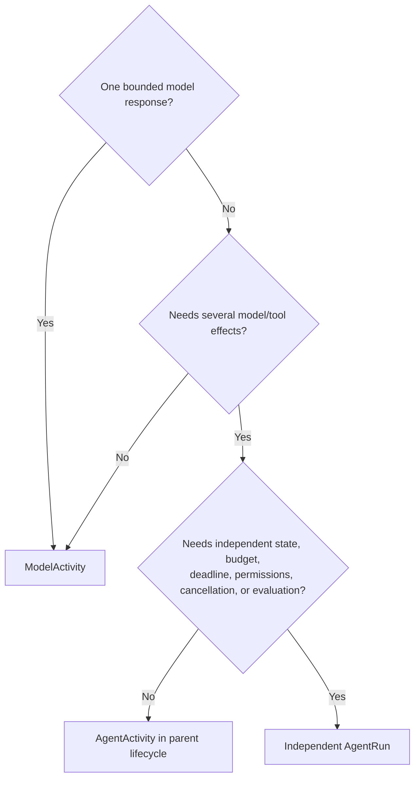

# Agents and multi-agent systems

> **Status: Informative guide.** Canonical resource and execution semantics are defined in the [ARA specification](/rfc/index).

## Agent resource model

```text
Agent
└── AgentVersion
    purpose and instructions
    model requirements
    capability requirements
    context recipe and memory policy
    policies and budgets
    termination conditions
    output contract
    evaluation suites
```

`Agent` is stable catalog identity. `AgentVersion` is immutable executable behavior.

## Model activity, agent activity, or agent run?



An inline `AgentActivity` references an `AgentVersion` but does not create an independent `AgentRun`. A child agent is an `AgentRun` created through explicit delegation.

## Delegation contract

```typescript
interface AgentDelegation {
  parentRunId: RunId;
  agentVersion: AgentVersionRef;
  taskSnapshot: TaskSnapshot;
  capabilityGrant: CapabilityGrant;
  budget: BudgetAllocation;
  deadline: Instant;
  resultSchema: SchemaRef;
}
```

Child capabilities are an explicit subset of delegated parent authority. Children do not automatically inherit secrets, private memory, mutating tools, or permission to create further children.

## Multi-agent threshold

A system is genuinely multi-agent when independent `AgentRun`s have separate tasks, state, lifecycle, capabilities, budgets, results, evaluation, and audit. Multiple roles in one prompt or several helper model calls do not require multi-agent architecture.

## Persistent identity

A customer, reviewer, case, or synthetic participant is a domain identity—not an agent run.

```text
SyntheticParticipant A
  stable participant ID
  persona version
  state versions
  scoped memory
  sessions
    -> model activities, agent activities, or child AgentRuns
```

Continuity comes from exact identity, state, memory, and provenance references, not reuse of a model process.
