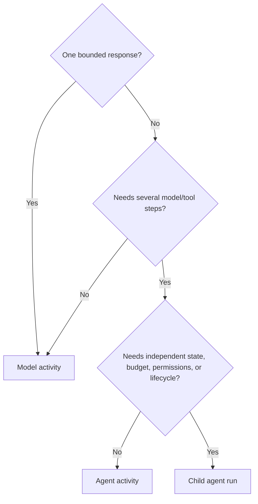

# Agents and multi-agent systems

## Agent model

```text
AgentDefinition
  -> AgentVersion
       purpose and instructions
       model requirements
       capability requirements
       context recipe and memory policy
       policies and budgets
       termination conditions
       output contract
       evaluation suites
```

An agent version is immutable after publication. It is an execution mechanism, not automatically a user-facing assistant, workflow, business entity, or persistent persona.

## Model call, agent activity, or child agent?



Use the least complex option that satisfies the lifecycle.

## Child-agent contract

A child agent is an independently executable run created by a parent through explicit delegation.

```typescript
interface AgentDelegation {
  parentRunId: RunId;
  childAgentVersion: AgentVersionRef;
  taskSnapshot: TaskSnapshot;
  delegatedCapabilities: CapabilityGrant;
  budget: BudgetAllocation;
  deadline: Instant;
  resultSchema: SchemaRef;
}
```

The default authority rule is:

```text
child capabilities are a subset of explicitly delegated parent capabilities
```

Children do not automatically inherit parent secrets, memory, tools, or permission to create further children.

## Multi-agent system

A system becomes genuinely multi-agent when independent agent runs have separate:

- Identities and versions.
- Tasks and result contracts.
- State and lifecycle.
- Capabilities and permissions.
- Budgets and termination conditions.
- Evaluation and audit records.

Multiple roles inside one prompt or several helper calls do not require multi-agent architecture.

## Persistent domain identity

Persistent identities remain separate from agent runs.

```text
SyntheticParticipant A
  stable participant ID
  persona version
  state versions
  scoped memory
  sessions
    -> ephemeral agent or model executions
```

The same participant across runs is reconstructed from exact persona, state, and memory references. It is not “the same” because the platform reuses one model process.

## Common multi-agent control patterns

| Pattern | Use |
|---|---|
| Coordinator and specialists | Explicit role separation and deterministic join |
| Parent and child runs | Independent lifecycle or authority |
| Debate/deliberation | Structured disagreement with verification |
| Ensemble | Independent candidates and aggregation |
| External agent collaboration | Organization boundary through A2A/service adapter |

## Multi-agent risks

- Authority amplification through delegation.
- Shared-memory leakage and races.
- Delegation cycles and runaway cost.
- Correlated model error presented as consensus.
- Ambiguous failure propagation.
- Excessive coordination overhead.

Each risk requires an explicit runtime, policy, and evaluation control.
