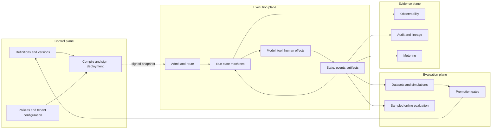

# Control, execution, evaluation, and evidence planes

## Plane model



## Control plane

Owns definitions, versions, deployment, environment promotion, tenant configuration, marketplace installation, model-routing profiles, governance configuration, and billing configuration. It should not be in the live model-token path.

## Execution plane

Owns live runs, activities, effects, waits, streaming, checkpoints, budgets, retries, cancellation, reconciliation, and runtime policy enforcement.

## Evaluation plane

Owns datasets, evaluators, offline and online jobs, adversarial scenarios, environment tests, baselines, and promotion gates. It consumes execution evidence but does not mutate historical run truth.

## Evidence systems

- **Observability** diagnoses latency, failures, and capacity.
- **Audit** records authoritative authorization and effect facts.
- **Lineage** records how inputs, effects, and artifacts derive from one another.
- **Metering** records attributable usage and cost.

They share identifiers but have different retention, access, and completeness requirements.

## Signed deployment contract

A production deployment snapshot pins:

```text
workflow, agent, prompt, tool, skill, and policy versions
context recipes and model-routing profile
evaluation suite and package installation revisions
runtime and event-schema compatibility
content digests and signature
```

Execution cells verify and cache snapshots. During a control-plane outage, admitted runs may continue under the last valid signed policy bundle, bounded staleness, and an emergency revocation channel.
