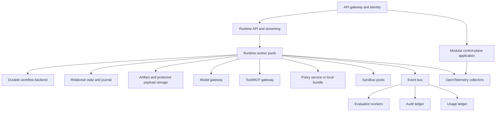

# Deployment and operations

## Recommended topology



Start with logical modules and separately scalable runtime, sandbox, and evaluation workers. Split more services only for scaling, security zones, residency, availability, team ownership, or commercial lifecycle.

## Persistence map

| Information | Primary store |
|---|---|
| Catalogs, tenants, policies, installations | Relational database |
| Current run projection | Strongly consistent relational/distributed SQL |
| Canonical run journal | Append-only relational/event store |
| Large provider payloads | Encrypted object storage |
| Artifacts | Immutable content-addressed object storage where practical |
| Checkpoints | Object or engine store; not audit truth |
| Memory metadata | Relational/document store |
| Vector/search indexes | Derived and rebuildable |
| Integration delivery | Broker plus transactional outbox |
| Telemetry | OpenTelemetry-compatible backend |
| Audit | Append-only/WORM store |
| Usage | Immutable financial ledger |

## Transaction pattern

```text
BEGIN
  verify expected state version
  append run events
  update state projection
  update effect/budget ledgers
  insert outbox records
COMMIT
```

## Versioning

Version every behaviorally relevant asset: workflow, agent, prompt, tool, skill, policy, context recipe, memory schema, model route, evaluator, dataset, package release, runtime contract, and event schema.

Use semantic version for compatibility and a content digest for exact identity.

## Migration

- Published versions remain immutable.
- Running workflows remain pinned to replay-compatible code.
- Event changes use explicit schema versions and upcasters.
- Database changes use expand–migrate–contract.
- Workflow upgrades run replay tests against historical histories.
- Package upgrades create a new installation revision and preserve rollback.
- Historical runs never appear to have used a newer version.

## SLOs

Separate platform availability from provider quality and availability. Important objectives include no acknowledged command loss, no repeated completed effect after worker loss, per-run event ordering, hard-budget enforcement before dispatch, approval-action integrity, resume after worker loss, audit completeness, and usage reconciliation.

## Disaster recovery

Fence the failed region, restore state/journal/engine history, restore approvals and timers, reconcile planned-but-unfinished effects, and resume only after ensuring a second active writer cannot commit. Irreversible effects require provider reconciliation after failover.

## Operational evolution

```text
Variant A: modular agentic application and one cell
-> Variant B: internal platform with shared catalogs and regional cells
-> Variant C: enterprise SaaS with isolation tiers, billing, and marketplace
```

Do not begin with fully distributed microservices or a public marketplace before the execution journal, policy boundary, and evaluation system are reliable.
