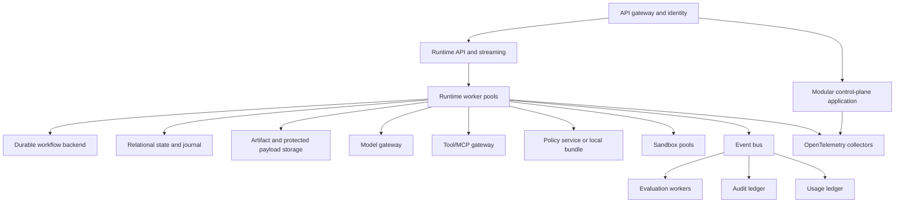

# Deployment and operations

## Recommended topology



Start with logical modules and separately scalable runtime, sandbox, and evaluation workers. Split more services only for scaling, security zones, residency, availability, team ownership, or commercial lifecycle.

## Persistence map

| Information | Primary store |
|---|---|
| Catalogs, tenants, policies, installations | Relational database |
| Current run projection | Strongly consistent relational/distributed SQL |
| Canonical run journal | Append-only relational/event store |
| Large provider payloads | Encrypted object storage |
| Artifacts | Immutable content-addressed object storage where practical |
| Checkpoints | Object or engine store; not audit truth |
| Memory metadata | Relational/document store |
| Vector/search indexes | Derived and rebuildable |
| Integration delivery | Broker plus transactional outbox |
| Telemetry | OpenTelemetry-compatible backend |
| Audit | Append-only/WORM store |
| Usage | Immutable financial ledger |

## Transaction pattern

```text
BEGIN
  verify expected stateVersion/runSequence
  append run events
  update state projection
  update effect/budget ledgers
  insert outbox records
COMMIT
```

## Versioning and migration

Version every behaviorally relevant asset. Use SemVer for compatibility and a digest for exact identity. Published versions remain immutable, event changes use schema versions/upcasters, database changes use expand–migrate–contract, workflow upgrades replay historical histories, and package upgrades preserve rollback.

Historical runs never appear to have used a newer version.

## Model lifecycle

Model routes are qualified, approved, monitored, deprecated, blocked, and retired independently of agents. A provider removal never causes silent substitution. See [Model lifecycle and provider change](/handbook/model-lifecycle).

## Cost and capacity

Budget reservation, provider concurrency/token limits, context/caching policy, and cost-per-successful-outcome metrics are part of operations. See [Cost governance and optimization](/handbook/cost-governance).

## SLOs

Separate platform availability from provider quality/availability. Objectives include command durability, event ordering, no repeated completed effect after worker loss, hard-budget enforcement, approval-action integrity, resume latency, audit/usage completeness, data-right completion, and dedicated-cell recovery.

## Disaster recovery

Fence the failed region, restore state/journal/engine history, restore approvals, timers, deletion tombstones and legal holds, reconcile planned-but-unfinished effects, and resume only after preventing a second active writer. Irreversible effects require provider reconciliation after failover.

## Testing and game days

Load, soak, chaos, security, sandbox, model-deprecation, backup/restore, and regional-failover tests are release and operational requirements, not optional evaluation extras. See [Testing and resilience program](/implementation/testing-and-resilience).

## Operational evolution

```text
Variant A: modular agentic application and one cell
-> Variant B: internal platform with shared catalogs and regional cells
-> Variant C: enterprise SaaS with isolation tiers, billing, and marketplace
```

Do not begin with fully distributed microservices or a public marketplace before the execution journal, policy boundary, evaluation system, and recovery program are reliable.
