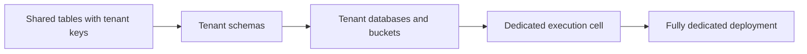

# Enterprise SaaS and multi-tenancy

## Tenant hierarchy

```text
Tenant
  -> Workspace
    -> Environment
      -> Deployment
        -> ExecutionPlanRun
          -> WorkflowRun
```

Tenant context must come from authenticated identity and trusted routing, not an arbitrary request field.

## Progressive isolation



| Model | Cost efficiency | Isolation | Recommended use |
|---|---:|---:|---|
| Shared app and tables | High | Logical | Development and lower-risk tenants |
| Tenant schemas | High-medium | Stronger data separation | Internal and enterprise workspaces |
| Tenant databases | Medium | Strong data isolation | Contractual/residency needs |
| Dedicated execution cell | Lower | Runtime and network isolation | High volume or regulated tenants |
| Fully dedicated | Lowest | Maximum | Sovereign and strict regulated environments |

The platform may support several tiers simultaneously and migrate a tenant without changing its agent definitions.

## Execution cells

A cell is a bounded regional or tenant-specific runtime containing run APIs, workers, scheduler, durable workflow backend, state/journal store, artifact store, model/tool gateways, sandbox pools, and telemetry collection.

Cells provide blast-radius control, capacity partitioning, residency, noisy-neighbor protection, and independent recovery.

## Authorization chain

```text
human or workload authenticates
-> platform resolves tenant/workspace
-> RBAC and ABAC authorize application use case
-> runtime receives a scoped capability grant
-> child run receives a narrower grant
-> gateway exchanges it for short-lived resource credentials
```

Resource-side authorization remains active. Internal network location does not imply trust.

## Tenant-scope checklist

Always scope database keys, cache keys, queues, vector and search filters, artifacts, memory, secrets, traces, usage records, budgets, model credentials, tool credentials, and package installations.

## Quotas and noisy-neighbor protection

Use tenant-partitioned queues, weighted fair scheduling, per-tenant active-run limits, per-model and per-tool concurrency, sandbox quotas, hierarchical token/cost limits, backpressure, circuit breakers, and reserved capacity.

## Bring your own model credentials

Store a tenant-scoped secret reference. The model gateway resolves short-lived credentials only after policy evaluation. Raw keys never enter prompts, workflow state, run events, or traces.

## Bring your own storage

Support customer object buckets, databases, vector indexes, encryption keys, private endpoints, retention, export, and deletion. Retain only the minimum platform metadata required for lifecycle, routing, audit, and metering.

## Regional routing

Choose the execution cell before payload processing based on tenant home region, data classification, isolation tier, private networking, model/tool locality, capacity, and disaster-recovery state.

## Disaster recovery

- Replicate catalogs and immutable deployment artifacts.
- Back up state, journal, artifacts, durable-engine history, approvals, and timers.
- Fence a failed cell before failover.
- Reconcile any effect planned but not conclusively completed.
- Never assume an external mutation did not occur merely because its region failed.

## SLO dimensions

Track platform run admission, accepted-command durability, run-event append, event-stream freshness, recovery after worker loss, policy latency, mandatory audit completeness, usage completeness, and dedicated-cell recovery separately from external provider availability.
