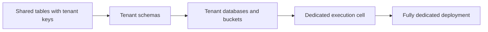

# Enterprise SaaS and multi-tenancy

## Tenant hierarchy

```text
Tenant -> Workspace -> Environment -> Deployment -> ExecutionPlanRun -> WorkflowRun
```

Tenant context must come from authenticated identity and trusted routing, not an arbitrary request field.

## Progressive isolation



| Model | Cost efficiency | Isolation | Recommended use |
|---|---:|---:|---|
| Shared app and tables | High | Logical | Development and lower-risk tenants |
| Tenant schemas | High-medium | Stronger data separation | Internal and enterprise workspaces |
| Tenant databases | Medium | Strong data isolation | Contractual/residency needs |
| Dedicated execution cell | Lower | Runtime and network isolation | High volume or regulated tenants |
| Fully dedicated | Lowest | Maximum | Sovereign and strict regulated environments |

The platform may support several tiers simultaneously and migrate a tenant without changing its agent definitions.

## Execution cells

A cell is a bounded regional or tenant-specific runtime containing run APIs, workers, scheduler, durable workflow backend, state/journal store, artifact store, model/tool gateways, sandbox pools, and telemetry collection. Cells provide blast-radius control, capacity partitioning, residency, noisy-neighbor protection, and independent recovery.

## Authorization chain

```text
human or workload authenticates
-> platform resolves tenant/workspace
-> RBAC and ABAC authorize application use case
-> runtime receives scoped capability grant
-> child run receives narrower grant
-> gateway exchanges it for short-lived resource credential
```

Resource-side authorization remains active. Internal network location does not imply trust.

## Tenant-scope checklist

Always scope database/cache keys, queues, vector/search filters, artifacts, memory, secrets, traces, audit, usage, budgets, credentials, package installations, deletion requests, and legal holds.

## Quotas and noisy-neighbor protection

Use tenant-partitioned queues, weighted fair scheduling, active-run limits, per-model/tool concurrency, sandbox quotas, hierarchical token/cost limits, backpressure, circuit breakers, and reserved capacity.

## Bring your own model and storage

Store tenant-scoped secret references and resolve short-lived credentials only after policy evaluation. Support customer buckets, databases, vector indexes, keys, private endpoints, retention, export, and deletion while retaining only minimum platform metadata required for lifecycle, routing, audit, and metering.

## Data rights, retention, and deletion

Data carries tenant, classification, region, purpose, provenance, retention policy, and legal-hold references. Sensitive content is kept behind protected payload/artifact references rather than duplicated into event metadata.

Deletion must propagate through authoritative stores, caches, search/vector indexes, memories, evaluation copies, and exports using lineage and durable tombstones. Backup restores reapply tombstones. Legal holds are explicit, scoped, authorized, and expiring.

See [Compliance mapping and data rights](/handbook/compliance-and-data-rights) for the shared-responsibility model and crypto-shredding limitations.

## Regional routing

Choose the execution cell before payload processing based on tenant home region, classification, isolation tier, private networking, model/tool locality, capacity, and disaster-recovery state.

## Disaster recovery

- Replicate catalogs and immutable deployment artifacts.
- Back up state, journal, artifacts, engine history, approvals, timers, deletion tombstones, and legal holds.
- Fence a failed cell before failover.
- Reconcile any effect planned but not conclusively completed.
- Never assume an external mutation did not occur merely because its region failed.

## SLO dimensions

Track admission, accepted-command durability, event append, stream freshness, worker-loss recovery, policy latency, mandatory audit completeness, usage completeness, deletion completion, and dedicated-cell recovery separately from external provider availability.
