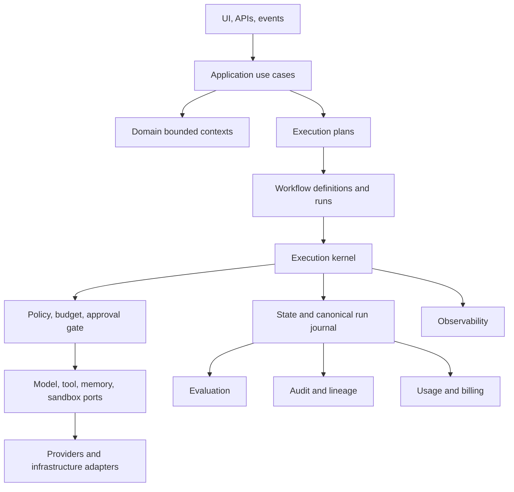

# Executive summary

Clean Architecture, Hexagonal Architecture, and Domain-Driven Design remain valid for AI systems, but they do not by themselves define durable execution, controlled nondeterminism, tool-side-effect safety, human suspension, replay, or evaluation. A production agentic architecture therefore adds a first-class **execution boundary** around model- and tool-driven behavior.

## Architectural formula

```text
Deterministic domain and application core
  -> durable execution kernel
    -> policy-enforced ports
      -> replaceable adapters
```

## Five consequential decisions

1. **An agent is a versioned specification; a run is an execution.** Production definitions are immutable and every run pins an exact deployment snapshot.
2. **Models propose; deterministic software authorizes and commits.** A model may suggest an action or branch, but may not directly mutate authoritative business state.
3. **The runtime is a combination.** Use an embeddable execution kernel, a horizontally scalable runtime service, a durable-workflow adapter, and an application-owned run journal.
4. **Execution truth is platform-owned.** Workflow-engine history and traces support operations, but the canonical run journal defines public execution semantics.
5. **Control and execution planes are separated and scaled through cells.** Start with one modular control plane and one execution cell; evolve toward regional and tenant-isolated cells.

## High-level architecture



## Recommended default deployment

- Modular control-plane application.
- Separately deployable runtime API and workers.
- Temporal-class durable workflow backend for critical long-running runs.
- Relational state store and append-only run journal.
- Object storage for artifacts and protected payloads.
- Model and tool gateways with policy and usage enforcement.
- OpenTelemetry-compatible observability.
- Separate evaluation workers and immutable usage ledger.

## Important conflicts

| Goal conflict | Default resolution |
|---|---|
| Portability vs provider features | Portable core plus explicit capability extensions |
| Autonomy vs determinism | Deterministic outer lifecycle with bounded agentic decisions |
| Replay vs privacy | Separate retained metadata from erasable encrypted payloads |
| Isolation vs unit economics | Progressive tenancy tiers and execution cells |
| Observability vs data minimization | Metadata by default; content only under explicit policy |
| Durability vs simplicity | Start with one managed durable backend, not in-process-only execution |

## Non-goals

The architecture does not promise byte-identical model regeneration, require event sourcing for every bounded context, make every process agentic, or hide provider differences behind a lowest-common-denominator API.
