# Marketplace architecture

A marketplace is a governed distribution and commercial system, not a prompt gallery or list of Git repositories.

## Package types

```text
Agents and templates
Workflows
Tools and connectors
Skills
Prompt packages
Policies
Evaluators and datasets
UI extensions
Complete agentic bundles
```

## Lifecycle

```mermaid
flowchart LR
    Build --> Provenance["SBOM and provenance"]
    Provenance --> Sign
    Sign --> Scan["Malware, secret, dependency, prompt-injection scan"]
    Scan --> Evaluate["Sandbox and evaluation"]
    Evaluate --> Review
    Review --> Publish["Immutable release"]
    Publish --> Install
    Install --> Resolve["Exact dependency lock"]
    Resolve --> Grant["Tenant grants capability subset"]
    Grant --> Configure["Secrets and configuration refs"]
    Configure --> Verify["Tenant-specific verification"]
    Verify --> Activate
    Activate --> Monitor
    Monitor --> Upgrade
    Monitor --> Revoke
```



## Release model

A package release contains exact content digests, semantic version, compatibility declarations, dependency ranges, requested capabilities, publisher identity, signature bundle, SBOM, build provenance, required verification tests, license, pricing, and deprecation policy.

Installation creates a tenant-scoped revision with:

- Exact dependency lock and digests.
- Requested versus granted capability scopes.
- Tenant configuration and secret references.
- Verification and evaluation results.
- Active, disabled, rolled-back, or revoked state.

A running deployment pins the installation-revision digest.

## Permissions

Packages request capabilities; administrators grant an explicit subset. Typical declarations cover model capabilities, tool scopes, data read/write classes, network destinations, secret purposes, filesystem, sandbox resources, and child-agent delegation.

A package cannot directly access platform databases, tenant secrets, provider credentials, shared event buses, host networking, or runtime internals.

## Supply-chain controls

- Verified publisher identity.
- Immutable digest and signature.
- SBOM and build provenance.
- Exact dependency lock and allowed registries.
- Vulnerability, malware, and secret scans.
- Prompt and tool-description injection tests.
- Sandbox and egress verification.
- Runtime behavior monitoring.
- Fast release and installation revocation.

Scanning cannot prove safety. Least privilege and runtime containment remain mandatory.

## Upgrade and rollback

An upgrade creates a new installation revision. Permission expansion requires new approval. Validate compatibility and evaluation baselines before activation. Preserve the previous exact revision for rollback. Published releases are never edited in place.

## Metering and commerce

Usage records attribute package release, tenant, run, activity, resource quantity, provider cost, customer-rated cost, and publisher share. Licensing and revenue sharing belong to the marketplace/billing contexts, not the execution kernel.
