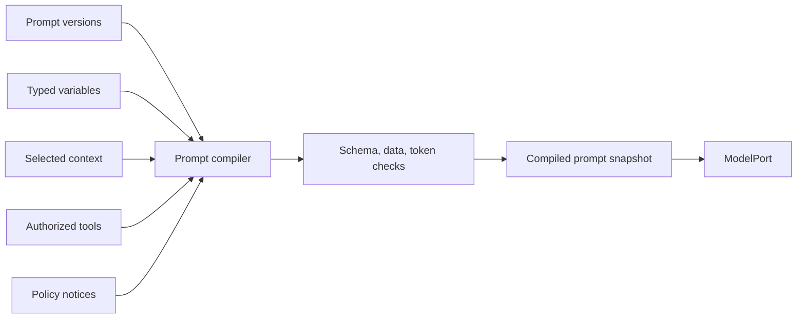

# Prompt and context management

Prompts are versioned behavioral assets, not anonymous strings embedded in code.

```text
PromptDefinition
  -> PromptVersion
       message templates and ordered sections
       typed variables
       context contract
       output contract
       model requirements
       policy references
       evaluation suite
```

## Definition and runtime snapshot

```typescript
interface PromptVersion {
  promptId: PromptId;
  version: SemanticVersion;
  digest: ContentDigest;
  messages: readonly MessageTemplate[];
  variables: readonly PromptVariable[];
  contextContract: ContextContract;
  outputContract?: SchemaRef;
  modelRequirements?: ModelRequirements;
  policyRefs: readonly PolicyVersionRef[];
  evaluationSuiteRefs: readonly EvaluationSuiteRef[];
}

interface CompiledPromptSnapshot {
  compilationId: CompilationId;
  promptVersionRefs: readonly PromptVersionRef[];
  messagesRef: PayloadRef;
  contextItemRefs: readonly ContextItemRef[];
  authorizedToolSchemaRefs: readonly ToolSchemaRef[];
  digest: ContentDigest;
  estimatedTokens: number;
  dataClassification: DataClassification;
}
```

## Deterministic composition

Prefer composable sections over one giant prompt:

```text
Platform behavioral base
+ tenant restrictions
+ agent role and purpose
+ activity-specific instructions
+ task data
+ selected context and evidence
+ authorized tool schemas
+ output schema
```

Merge rules must prevent a lower-authority layer from weakening a higher-authority restriction:

| Section | Merge rule |
|---|---|
| Safety and tenant restrictions | Additive only |
| Capability limits | Intersection |
| Output schema | Exact pinned contract |
| Task objective | Per-run value |
| Style | Lower layer may override |
| Tool descriptions | Generated only from authorized tools |

## Typed variables

Variables declare schema, source, sensitivity, and limits. They must not resolve arbitrary global state or secrets.

```yaml
variables:
  - name: research_question
    source: task
    schema: { type: string, maxLength: 4000 }
    sensitivity: internal
  - name: evidence
    source: artifact
    schemaRef: EvidenceBundle@2
    sensitivity: confidential
```

## Context contract

The prompt states what context it needs. A versioned context recipe decides how records are selected, ordered, compacted, and redacted.

```yaml
context:
  required:
    - type: contract
      minimum: 1
  optional:
    - type: policy_document
      maximum: 5
  maximumTokens: 24000
  requireProvenance: true
  allowedClassifications: [internal, confidential]
```

## Compilation pipeline



The compiler records the exact source references, section versions, compaction decisions, output schema, and final digest.

## Lifecycle

```text
draft -> review -> offline evaluation -> publish immutable version
-> include in deployment snapshot -> monitor -> create a new version
```

Never resolve `latest` during a run. A prompt change is a behavioral code change and should pass regression, safety, cost, and tool-use gates.

## Security rule

Prompts communicate behavior and context. They do not grant permission, enforce tenant boundaries, protect credentials, or authorize tools. Those controls live in deterministic policy and capability gateways.
