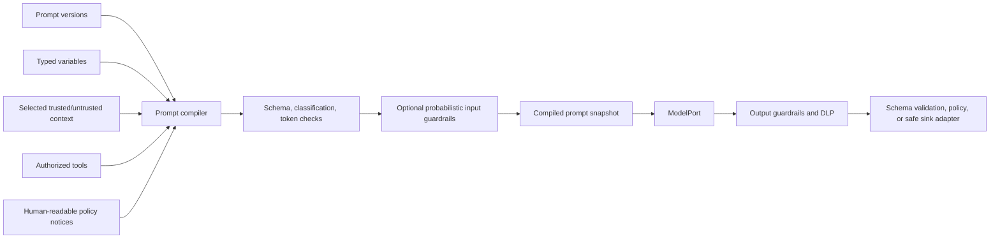

# Prompt and context management

Prompts are versioned behavioral assets, not anonymous strings embedded in code.

```text
PromptDefinition
  -> PromptVersion
       message templates and ordered sections
       typed variables
       context contract
       output contract
       model requirements
       policy references
       evaluation suite
```

## Definition and runtime snapshot

```typescript
interface PromptVersion {
  promptId: PromptId;
  version: SemanticVersion;
  digest: ContentDigest;
  messages: readonly MessageTemplate[];
  variables: readonly PromptVariable[];
  contextContract: ContextContract;
  outputContract?: SchemaRef;
  modelRequirements?: ModelRequirements;
  policyRefs: readonly PolicyVersionRef[];
  evaluationSuiteRefs: readonly EvaluationSuiteRef[];
}

interface CompiledPromptSnapshot {
  compilationId: CompilationId;
  promptVersionRefs: readonly PromptVersionRef[];
  messagesRef: PayloadRef;
  contextItemRefs: readonly ContextItemRef[];
  authorizedToolSchemaRefs: readonly ToolSchemaRef[];
  digest: ContentDigest;
  estimatedTokens: number;
  dataClassification: DataClassification;
}
```

## Deterministic composition

Prefer composable sections over one giant prompt:

```text
Platform behavioral base
+ tenant restrictions
+ agent role and purpose
+ activity-specific instructions
+ task data
+ selected context and evidence
+ authorized tool schemas
+ output schema
```

Merge rules prevent a lower-authority layer from weakening a higher-authority restriction. Safety/tenant notices are additive, capability limits intersect, output schemas are pinned, and tool descriptions are generated only from authorized definitions.

## Typed variables and context

Variables declare schema, source, sensitivity, and limits. They must not resolve arbitrary global state or secrets. The prompt states what context it needs; a versioned context recipe selects, orders, compacts, and redacts actual records with provenance.

## Compilation pipeline



The compiler records exact source references, trust labels, section versions, compaction decisions, output schema, and final digest.

## Untrusted content rule

User content, retrieval, memories, tool results, and peer-agent output remain data even when they contain imperative language. Context items carry source, trust, classification, and provenance. A model must not gain capabilities because untrusted text claims that a tool or policy is authorized.

## Guardrail rule

Probabilistic guardrails may classify, redact, deny, or escalate inputs and outputs. They are versioned and evaluated, and their decisions are recorded. They do not grant authorization, replace output-schema validation, or make unsafe sink interpolation acceptable.

## Lifecycle

```text
draft -> review -> offline evaluation -> publish immutable version
-> include in deployment snapshot -> monitor -> create a new version
```

Never resolve `latest` during a run. A prompt change is a behavioral code change and should pass regression, safety, cost, injection, output-handling, and tool-use gates.

## Security rule

Prompts communicate behavior and context. They do not grant permission, enforce tenant boundaries, protect credentials, authorize tools, authenticate peer agents, or sanitize output for a downstream interpreter. Those controls live at deterministic identity, policy, capability, and sink boundaries.
