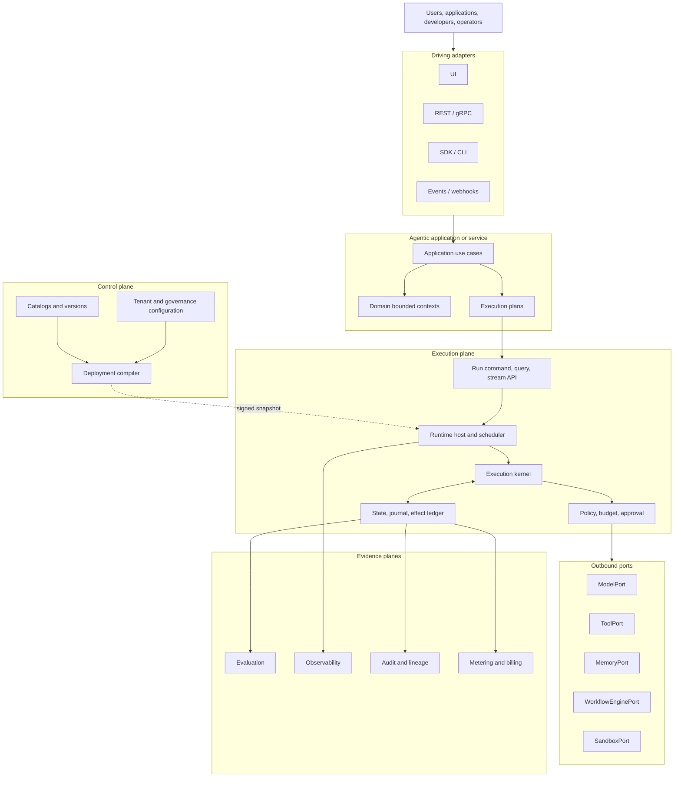

# Reference architecture

## System decomposition

## Layer ownership

| Layer | Owns | Must not own |
|---|---|---|
| Domain | Business language, identities, invariants | SDKs, workers, retries, databases |
| Application | User-facing commands, queries, and transactions | Agent loops, provider streams, worker recovery |
| Execution kernel | Legal run transitions and effect planning | Provider clients, queues, secrets |
| Runtime host | Scheduling, leases, waits, streaming, recovery | Business truth and publication lifecycle |
| Control plane | Catalogs, versions, promotion, tenant config, packages | Live run state |
| Ports | Stable capability contracts | Vendor-specific request types |
| Adapters | Technology integration and normalization | Domain semantics |
| Evaluation | Quality and safety judgments | Authoritative run state |
| Observability | Operational causality and performance | Audit truth |

## Source dependency rule

Source-code dependencies point inward. Adapters implement interfaces owned by the application or execution core. Runtime calls travel outward through those interfaces, but the domain never imports provider or infrastructure libraries.

## Plane separation

The control plane publishes signed deployment snapshots. Execution cells cache and verify them. An authoring outage should not automatically stop admitted runs. Emergency revocation and bounded policy staleness are explicit operational concerns.
