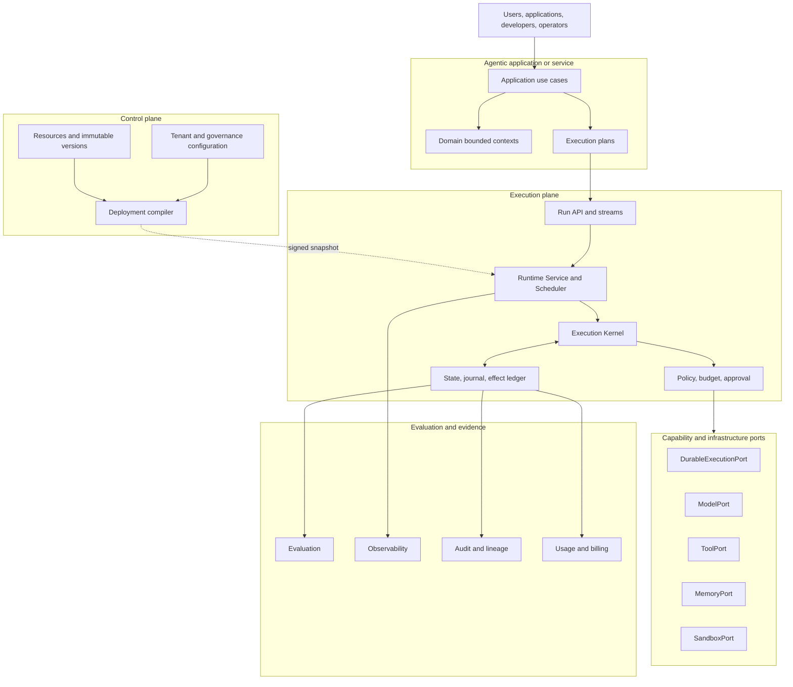

# Reference architecture overview

> **Status: Informative overview.** Normative requirements live under [ARA specification](/rfc/index).

Source dependencies point inward. Domain and application code do not import model SDKs, durable backends, databases, brokers, cloud APIs, or observability vendors.

Read [Resource and version model](/rfc/resource-model), [Execution model](/rfc/execution-model), [Runtime and kernel](/rfc/runtime), and [Platform architecture](/rfc/platform).
