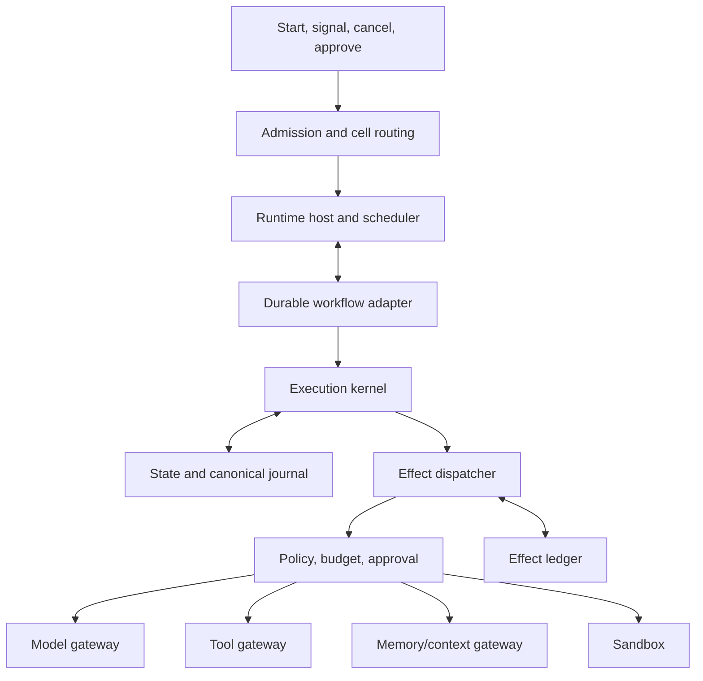
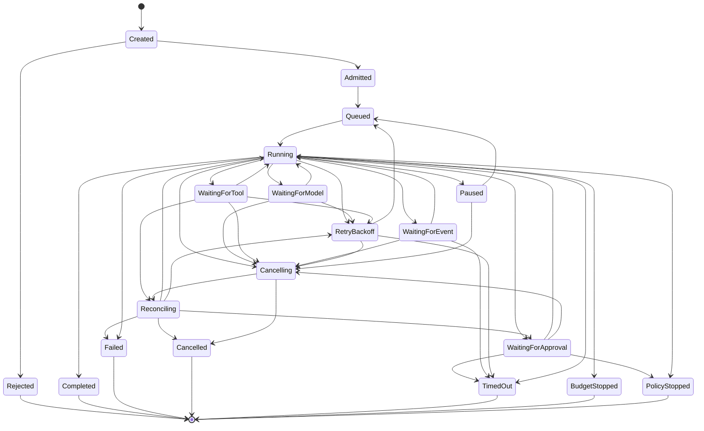
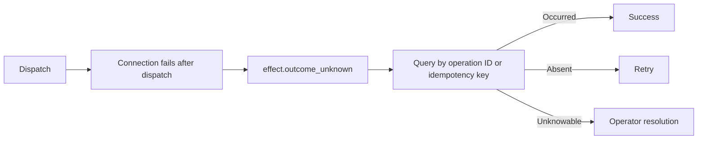

# Runtime architecture

## Recommended composition

The runtime should be a combination rather than a single library or engine:

```text
Framework-neutral execution-kernel library
+ horizontally scalable runtime service
+ durable-workflow adapter
+ platform-owned canonical run journal
+ effect and idempotency ledger
+ optional per-run actor or lease
```



## Ownership

| Component | Owns | Must not own |
|---|---|---|
| Execution kernel | Legal transitions, dependency resolution, intents, completion | Workers, SDKs, queue offsets, secrets |
| Runtime host | Admission, scheduling, leases, streaming, cancellation | Business invariants and publication |
| Durable engine | Timers, signals, suspension, activity retry, recovery | Public domain model and audit semantics |
| Platform run journal | Canonical execution facts and stable public run semantics | Token-level streaming and provider internals |
| Effect ledger | Effect identity, invocation attempts, ambiguous outcomes, reconciliation | Business completion decisions |

## State machine



Waiting releases active compute. A terminal run cannot produce new effects.

## Effect versus invocation

An effect is one logical external or nondeterministic operation. An invocation attempt is one concrete adapter/provider call used to realize or reconcile that effect.

```text
ActivityRun -> 0..N EffectRecords -> 0..N InvocationAttempts
```

A transport retry keeps the same effect ID, payload digest, and idempotency key but creates a new invocation-attempt ID. A semantic retry that changes the prompt, context, arguments, or objective creates a new effect.

## Effect lifecycle

```text
Effect proposed
-> schema and semantic validation
-> policy decision
-> budget reservation
-> human approval when required
-> effect.planned event committed
-> invocation attempt(s)
-> result, failure, or ambiguous outcome recorded
-> actual usage reconciled
-> state advanced
```

The intent must be durable before dispatch so worker failure cannot erase evidence that an effect may have occurred.

## Idempotency and retry

A suitable logical idempotency key is:

```text
{tenant}/{run}/{activity}/{effect-ordinal}/{intent-digest}
```

It remains stable across invocation attempts. Do not include a random retry ID.

| Operation | Retry rule |
|---|---|
| Pure calculation | Retry the qualified activity attempt if needed |
| Read-only effect | Bounded invocation backoff |
| Model effect | Preserve each semantic effect; deduplicate transport duplicates |
| Idempotent write | Retry invocations with the same key |
| Reversible write | Reconcile an uncertain outcome before retry |
| Irreversible write | Require provider idempotency or reconciliation; otherwise suspend |

`retryable` and `safeToRetry` are separate error properties.

## Ambiguous outcome



Blindly retrying an irreversible effect is prohibited.

## Concurrency

Use one authoritative state-transition writer per run with controlled parallel effects. Parallel branches are allowed only when no dependency edge exists, policy and budgets allow concurrency, results can be deterministically joined, and branches do not mutate shared state directly.

## Budgets and runaway detection

Budgets are hierarchical: tenant, workspace, deployment, plan, run, activity, branch/trial/iteration where applicable, effect, and invocation attempt.

Dimensions include money, tokens, wall time, active compute, activities, model calls, tool calls, iteration count, trial count, child depth, sandbox compute, data volume, and risk-weighted effects.

Detect repeated action digests, no-progress cycles, delegation loops, escalating context without quality gain, repeated policy denials, and abnormal cost velocity.

## Replay

| Mode | Purpose |
|---|---|
| Operational resume | Continue pending work without repeating completed effects |
| Evidence replay | Reconstruct state using captured effect outcomes |
| Counterfactual rerun | Start a new run with historical inputs and changed versions |

Workflow-engine history and checkpoints support recovery, but the platform-owned journal defines stable execution semantics.

## Streaming

Use two streams: durable semantic events for run/activity/effect lifecycle and ephemeral detail for token deltas, tool stdout, and progress text. Ephemeral detail may be sampled and is not an audit source.

## Default engine choice

A Temporal-class durable engine is the recommended default for critical long-running work. LangGraph can implement agentic graph execution behind an adapter. Airflow, Dagster, and Prefect are generally stronger for scheduled data and evaluation pipelines. Actor systems are useful for hot-state serialization but should not be the sole persistence or audit mechanism.
