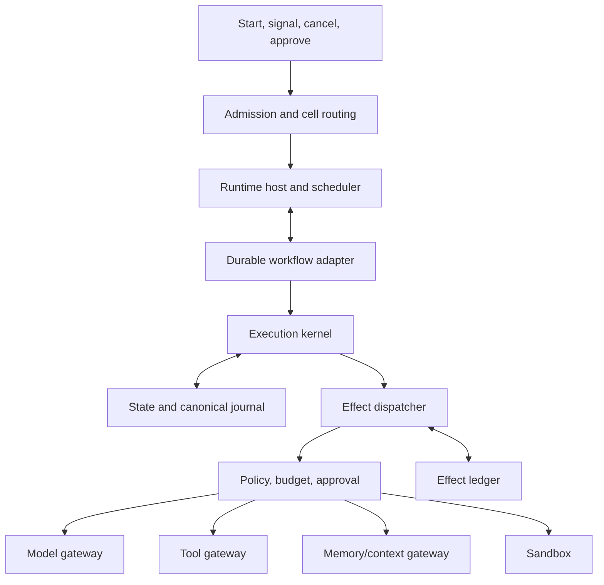
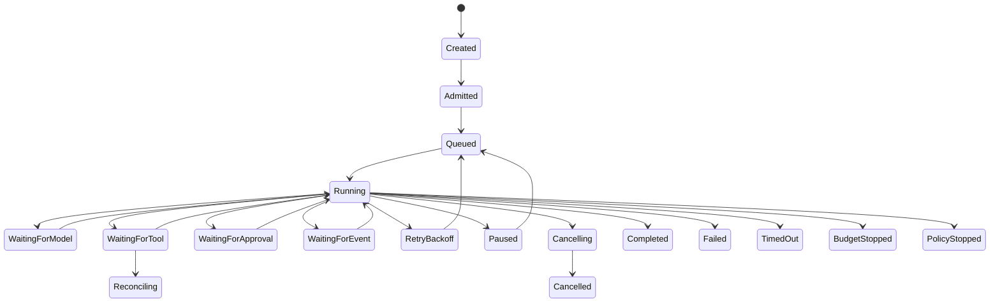
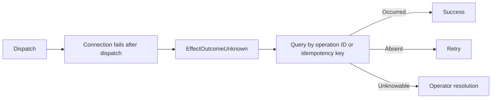

# Runtime architecture

## Recommended composition

The runtime should be a combination rather than a single library or engine:

```text
Framework-neutral execution-kernel library
+ horizontally scalable runtime service
+ durable-workflow adapter
+ application-owned run journal
+ effect and idempotency ledger
+ optional per-run actor or lease
```



## Ownership

| Component | Owns | Must not own |
|---|---|---|
| Execution kernel | Legal transitions, dependency resolution, intents, completion | Workers, SDKs, queue offsets, secrets |
| Runtime host | Admission, scheduling, leases, streaming, cancellation | Business invariants and publication |
| Durable engine | Timers, signals, suspension, activity retry, recovery | Public domain model and audit semantics |
| Run journal | Canonical execution facts | Token-level streaming and provider internals |
| Effect ledger | Idempotency, attempts, ambiguous outcomes, reconciliation | Business completion decisions |

## State machine



Waiting releases active compute. A terminal run cannot produce new effects.

## Effect lifecycle

```text
Effect proposed
-> schema and semantic validation
-> policy decision
-> budget reservation
-> human approval when required
-> EffectPlanned event committed
-> dispatch
-> result, failure, or ambiguous outcome recorded
-> actual usage reconciled
-> state advanced
```

The intent must be durable before dispatch so worker failure cannot erase evidence that an effect may have occurred.

## Idempotency and retry

A suitable logical idempotency key is:

```text
{tenant}/{run}/{activity}/{effect-ordinal}/{intent-digest}
```

It remains stable across attempts. Do not include a random retry ID.

| Operation | Retry rule |
|---|---|
| Pure calculation | Retry freely |
| Read-only retrieval | Bounded backoff |
| Model invocation | Preserve each semantic attempt; deduplicate transport duplicates |
| Idempotent write | Retry with the same key |
| Reversible write | Reconcile an uncertain outcome before retry |
| Irreversible write | Require provider idempotency or reconciliation; otherwise suspend |

`retryable` and `safeToRetry` are separate error properties.

## Ambiguous outcome



Blindly retrying an irreversible effect is prohibited.

## Concurrency

Use one authoritative state-transition writer per run with controlled parallel effects. Enforce this through a durable workflow instance, optimistic `stateVersion`, lease/fencing token, actor, or a combination.

Parallel branches are allowed only when:

- No dependency edge exists between them.
- Policy and budgets allow concurrency.
- Results can be deterministically joined.
- They do not mutate shared state directly.

## Budgets and runaway detection

Budgets are hierarchical: tenant, workspace, deployment, plan, run, activity, attempt, effect.

Dimensions include money, tokens, wall time, active compute, steps, model calls, tool calls, iteration count, child depth, sandbox compute, data volume, and risk-weighted effects.

Detect repeated action digests, no-progress cycles, delegation loops, escalating context without quality gain, repeated policy denials, and abnormal cost velocity. Responses may reduce capability, switch to a declared deterministic fallback, request help, or stop.

## Replay

| Mode | Purpose |
|---|---|
| Operational resume | Continue pending work without repeating completed effects |
| Evidence replay | Reconstruct state using captured model/tool outcomes |
| Counterfactual rerun | Start a new run with historical inputs and changed versions |

Workflow-engine history and checkpoints support recovery, but the application-owned journal defines stable platform semantics.

## Streaming

Use two streams:

- **Durable semantic events:** run and activity lifecycle, approvals, tool completion, artifacts, terminal state.
- **Ephemeral detail:** token deltas, tool stdout, progress text. This may be sampled or compacted and is not an audit source.

## Default engine choice

A Temporal-class durable engine is the recommended default for critical long-running work. LangGraph can implement agentic graph execution behind an adapter. Airflow, Dagster, and Prefect are generally stronger for scheduled data and evaluation pipelines. Actor systems are useful for hot-state serialization but should not be the sole persistence or audit mechanism.
