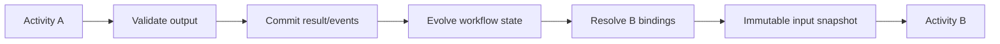

# Workflows and execution plans

> **Status: Informative guide.** Canonical terminology is defined in [RFC — Execution model](/rfc/execution-model).

## Workflow version

A `WorkflowVersion` is an immutable executable process specification:

```text
metadata and compatibility
input/output/state contracts
activities and dependencies
explicit input bindings
control flow
policies and budgets
completion and evaluation contracts
```

## Activity taxonomy

```text
TaskActivity        deterministic code
ModelActivity       one bounded model effect
AgentActivity       bounded multi-effect agent behavior
ToolActivity        one explicit capability effect
HumanActivity       approval, review, or data entry
WorkflowActivity    reference to another WorkflowVersion
DecisionActivity    guarded branch selection
ParallelActivity    fork with explicit join
IterationActivity   repeated body with completion policy
EventActivity       correlated external wait
TimerActivity       durable time wait
EvaluationActivity  explicit quality/safety assessment
```

An activity is atomic where independent contracts, policy, budget, retry, evaluation, or observability matter. Meaningful internal dependencies belong in a referenced workflow.

## Control flow and orchestration

| Concern | Question | Owner |
|---|---|---|
| Control flow | What happens next? | Execution Kernel |
| Execution strategy | How should one activity produce a result? | Activity strategy |
| Scheduling | When and where should runnable work execute? | Scheduler |
| Distributed orchestration | How are waits, retries, children, and signals coordinated? | Runtime Service and durable adapter |
| Application orchestration | Which process should start? | Application layer |
| Cross-run orchestration | How are workflow runs chained? | Execution plan |

## Explicit data binding



```yaml
activity: verify-compliance
input:
  vendorId:
    from: activities.research-vendor.output.vendorId
  evidence:
    from: activities.research-vendor.output.evidenceArtifact
```

A whole-activity retry reuses the same input snapshot. A new `Iteration` or semantic `Effect` may use a new snapshot.

## Retry versus iteration

| Retry | Iteration |
|---|---|
| Recover operational failure | Continue intentionally |
| Same logical input | Updated state, evidence, or objective |
| New `ActivityAttempt` or `Invocation` | New `Iteration` |
| Runtime retry policy | Workflow completion policy |

A `DeliberationRound` is a domain-facing iteration and may execute a multi-activity body.

## Composition

A `WorkflowActivity` references a `WorkflowVersion`.

- Inline mode compiles work into the parent `WorkflowRun`.
- Child mode starts a separate `WorkflowRun` when independent state, budget, deadline, cancellation, failure, or evaluation is required.

## Execution plans

An `ExecutionPlanVersion` coordinates separate workflow runs across time, ownership, deployment, or evaluation boundaries. Dependencies use exact artifact references and explicit decisions, never mutable “latest output.”

## Join policies

```text
all_successful
all_completed
any_successful
quorum
required_plus_optional
best_before_deadline
manual_selection
quality_threshold
```

Parallel branches return immutable results and merge deterministically.
