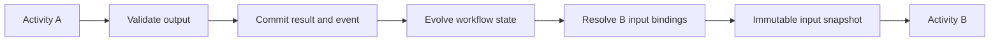
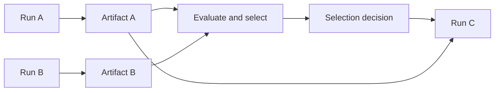

# Workflows and execution plans

## Workflow definition

A workflow is a reusable executable process definition.

```text
WorkflowDefinition
  Metadata
  Input and output contracts
  State schema
  Activity definitions
  Dependencies and input bindings
  Control flow
  Policies and budgets
  Completion policy
  Evaluation contract
```

## Activity taxonomy

```text
TaskActivity        deterministic code
ModelActivity       one bounded model call
AgentActivity       bounded multi-step agent behavior
ToolActivity        one explicit external capability
HumanActivity       approval, review, or data entry
WorkflowActivity    composition with another workflow
DecisionActivity    branch selection and guards
ParallelActivity    fork with explicit join policy
IterationActivity   repeated multi-step cycle
EventActivity       wait for correlated event
TimerActivity       durable wait
EvaluationActivity  quality or safety assessment
```

A workflow contains activities, not runtime steps. At execution time:

```text
ActivityDefinition -> ActivityRun -> AttemptRun -> Effect
```

## Control flow versus orchestration

| Concern | Question | Owner |
|---|---|---|
| Control flow | What happens next? | Execution kernel |
| Execution strategy | How should one activity produce a result? | Activity strategy |
| Scheduling | When and on which worker? | Runtime scheduler |
| Orchestration | How are waits, retries, children, and signals coordinated? | Runtime and durable engine |
| Application orchestration | Which process should start? | Application layer |
| Cross-run orchestration | How are several workflow runs chained? | Execution plan |

## Explicit data binding

Activity output does not flow implicitly into shared mutable state.



```yaml
activity: verify-compliance
input:
  vendorId:
    from: activities.research-vendor.output.vendorId
  evidence:
    from: activities.research-vendor.output.evidenceArtifact
  policyVersion:
    from: deployment.policies.compliance
```

Retries reuse the same input snapshot unless the workflow creates a new logical activity run.

## Iteration versus retry

| Retry | Iteration |
|---|---|
| Repeats after operational failure | Repeats intentionally with updated state or evidence |
| Same `ActivityRun` | New `IterationRun` |
| New `AttemptRun` | New body-workflow execution |
| Runtime retry policy | Workflow completion policy |

A deliberation “round” is a domain-friendly name for an iteration. It may contain many dependent activities such as independent survey, normalization, challenge, verification, synthesis, and evaluation.

## Workflow composition

Do not require a separate `SubWorkflow` type. A `WorkflowActivity` references another workflow definition. At runtime it may execute nested in the parent lifecycle or as a child workflow run when independent state, budget, failure, cancellation, or evaluation is required.

## Execution plans

An execution plan coordinates multiple workflow runs across time or ownership boundaries.



Use exact artifact digests and explicit decisions. Do not bind to a mutable “latest output.”

## Join and completion policies

```text
all_successful
all_completed
any_successful
quorum
required_plus_optional
best_before_deadline
manual_selection
quality_threshold
```

Parallel branches return immutable results and merge through deterministic logic rather than directly mutating shared state.
