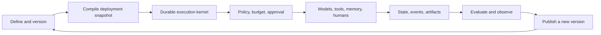

# Agentic Reference Architecture

> **Models propose. Deterministic software, policy, and humans authorize. The runtime executes, persists, and audits.**

This site is the source of truth for a production-grade architecture that supports a single agent, deterministic and agentic workflows, durable long-running execution, multi-agent systems, enterprise SaaS, and an extensible marketplace.



## The clean mental model

```text
Domain application
  -> Execution plans
    -> Workflow runs
      -> Activity runs
        -> Attempts
          -> Effects
```

- The **application** owns business outcomes.
- An **execution plan** coordinates multiple workflow runs.
- A **workflow** coordinates activities inside one run.
- The **runtime** makes execution durable.
- **Ports and adapters** isolate models, tools, engines, stores, and vendors.
- **Evaluation** determines whether behavior is good enough to promote.

## Start here

<CardGroup cols={2}>
  <Card title="Architecture cheatsheet" icon="bolt" href="/cheatsheets/architecture">
    The complete model on one compact page.
  </Card>
  <Card title="Executive summary" icon="map" href="/handbook/executive-summary">
    Scope, conclusions, and consequential decisions.
  </Card>
  <Card title="Terminology" icon="book-open" href="/handbook/terminology">
    Distinguish applications, workflows, agents, runtimes, and platforms.
  </Card>
  <Card title="Evaluation-driven development" icon="flask" href="/evaluation/evaluation-driven-development">
    Build quality gates into every version and release.
  </Card>
</CardGroup>

## What this architecture rejects

- Model output as a reliable business invariant.
- A framework as the entire system architecture.
- A vector database as universal memory.
- Prompts as authorization controls.
- Hidden mutable state between activities or runs.
- Unbounded retries, autonomy, cost, or delegation.
- Marketplace plugins that bypass platform policy and gateways.
