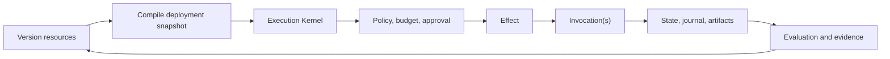

# Agentic Reference Architecture

> **Models propose. Deterministic software, policy, and humans authorize. The runtime executes, persists, and records.**

ARA combines a compact normative standard, exact reference contracts, implementation guides, reusable patterns, and worked examples. It supports one production agent, deterministic and agentic workflows, long-running stateful execution, multi-agent systems, enterprise platforms, and governed marketplaces.

<CardGroup cols={2}>
  <Card title="Read the standard" icon="book" href="/rfc/index">
    Normative resource, execution, runtime, platform, security, and evaluation rules.
  </Card>
  <Card title="Architecture cheatsheet" icon="bolt" href="/cheatsheets/architecture">
    Canonical names and decision rules in one compact view.
  </Card>
  <Card title="Reference contracts" icon="code" href="/reference/index">
    Glossary, conventions, interfaces, state/events, API, and manifests.
  </Card>
  <Card title="Guides" icon="compass" href="/guides/index">
    Apply the standard to application, runtime, platform, security, cost, and operations design.
  </Card>
  <Card title="Patterns and examples" icon="diagram-project" href="/patterns/index">
    Agentic control, deliberation, experiments, child runs, compensation, and complete scenarios.
  </Card>
  <Card title="Project governance" icon="sitemap" href="/project/documentation-architecture">
    Authority, page types, decisions, research, audits, and change propagation.
  </Card>
</CardGroup>

## Clean mental model

```text
stable resource
  -> immutable resource version
    -> durable run
      -> activity run
        -> logical effect
          -> concrete invocation
```

Optional subordinate scopes include `ActivityAttempt`, `ExecutionBranch`, and `Iteration`. Temporary runtime ownership is a `WorkerLease`. Independent experiment repetitions are `ExperimentTrial`s in the experiment/evaluation bounded context.

## Architecture shape



## Conformance profiles

```text
ARA Core
  -> ARA Durable
    -> ARA Enterprise
      -> ARA Marketplace or ARA Regulated
```

An implementation adopts only the profiles justified by its risk and scale. A one-shot summarizer does not need the same runtime as a regulated multi-tenant marketplace.

## What ARA rejects

- Model output as a business invariant.
- A framework as the complete architecture.
- Prompts as authorization controls.
- A vector database as universal state or memory.
- Hidden mutable data flow between activities or runs.
- Unqualified `Step`, `Round`, `AttemptRun`, or `SubAgent` core types.
- Blind retries of ambiguous mutations.
- Marketplace code that bypasses platform gateways.
