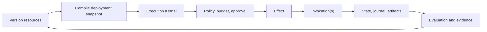

# Agentic Reference Architecture

> **Models propose. Deterministic software, policy, and humans authorize. The runtime executes, persists, and records.**

ARA combines a compact normative specification, exact reference contracts, verifiable implementation guidance, reusable patterns, worked examples, and explicit conformance evidence. It supports one production agent, deterministic and agentic workflows, long-running stateful execution, multi-agent systems, enterprise platforms, and governed marketplaces.

<Note>ARA 1.0 is a candidate independent technical specification. It is not an RFC Series publication, formal standards-body standard, legal certification, or security attestation.</Note>

<CardGroup cols={2}>
  <Card title="Adopt ARA" icon="route" href="/guides/adoption">
    Select the smallest justified profile, build one vertical slice, and produce review evidence.
  </Card>
  <Card title="Read the specification" icon="book" href="/specification/index">
    Normative resource, execution, runtime, platform, security, and evaluation rules.
  </Card>
  <Card title="Architecture cheatsheet" icon="bolt" href="/cheatsheets/architecture">
    Canonical names, boundaries, and decision rules in one compact view.
  </Card>
  <Card title="Reference contracts" icon="code" href="/reference/index">
    Glossary, conventions, interfaces, events/state, optional profiles, and diagrams.
  </Card>
  <Card title="Build runtime and adapters" icon="gears" href="/handbook/runtime">
    Implement durable execution, then qualify provider integrations behind canonical ports.
  </Card>
  <Card title="Assess conformance" icon="list-check" href="/reference/conformance-checklist">
    Map cumulative ARA profiles to implementation, test, recovery, and assurance evidence.
  </Card>
  <Card title="Patterns and examples" icon="diagram-project" href="/patterns/index">
    Agentic control, deliberation, experiments, child runs, compensation, and complete scenarios.
  </Card>
  <Card title="Project governance" icon="sitemap" href="/project/index">
    Decisions, releases, documentation architecture, research, review history, and maintenance.
  </Card>
</CardGroup>

## Clean mental model

```text
stable resource
  -> immutable resource version
    -> durable run
      -> activity run
        -> logical effect
          -> concrete invocation
```

Optional subordinate scopes include `ActivityAttempt`, `ExecutionBranch`, and `Iteration`. Temporary runtime ownership is a `WorkerLease`. Independent experiment repetitions are `ExperimentTrial`s in the experiment/evaluation bounded context.

## Architecture shape



## Conformance profiles

```text
ARA Core
  -> ARA Durable
    -> ARA Enterprise
      -> ARA Marketplace or ARA Regulated
```

An implementation adopts only the profiles justified by its risk and scale. A one-shot summarizer does not need the same runtime as a regulated multi-tenant marketplace. A technical claim identifies the ARA semantic version, exact publication commit or digest, implementation deployment digest, applicable profiles, deviations, and evidence package; use the [Conformance checklist](/reference/conformance-checklist).

## What ARA rejects

- Model output as a business invariant.
- A framework as the complete architecture.
- Prompts as authorization controls.
- A vector database as universal state or memory.
- Hidden mutable data flow between activities or runs.
- The normative core does not define unqualified `Step`, `Round`, `AttemptRun`, or `SubAgent` types.
- Blind retries of ambiguous mutations.
- Marketplace code that bypasses platform gateways.

See [Guides](/guides/index) for task-oriented implementation paths and [Project](/project/index) for publication and maintenance governance.