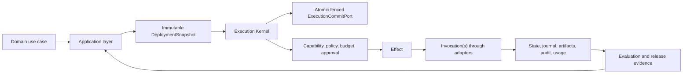

# Agentic Reference Architecture

> **Models propose. Deterministic software, policy, resource authorization, and humans authorize. The runtime executes, persists, and records.**

ARA combines a compact normative specification, machine-readable contracts, reference profiles, verifiable implementation guidance, reusable patterns, enterprise worked examples, and explicit conformance evidence. It supports one production agent, deterministic and agentic workflows, long-running stateful execution, multi-agent systems, internal platforms, multi-tenant SaaS, and governed marketplaces.

<Note>ARA 1.0 is a candidate independent technical specification. It is not an RFC Series publication, formal standards-body standard, legal certification, security attestation, or proof of operational effectiveness.</Note>

<CardGroup cols={2}>
  <Card title="Adopt ARA" icon="route" href="/guides/adoption">
    Select Core plus only the composable modules you need, build one vertical slice, and produce evidence.
  </Card>
  <Card title="Read the specification" icon="book" href="/specification/index">
    Normative boundaries, resource grammar, execution, runtime, platform, security, and evaluation rules.
  </Card>
  <Card title="Architecture cheatsheet" icon="bolt" href="/cheatsheets/architecture">
    Canonical terms, ownership boundaries, retry scopes, and decision rules.
  </Card>
  <Card title="Machine contracts" icon="brackets-curly" href="/reference/contract-catalog">
    Schemas, registries, fixtures, OpenAPI, AsyncAPI, versions, and validation.
  </Card>
  <Card title="Build runtime and adapters" icon="gears" href="/handbook/runtime">
    Implement atomic durable execution, then qualify providers and protocols behind canonical ports.
  </Card>
  <Card title="Assess conformance" icon="list-check" href="/reference/conformance-checklist">
    Map Core, Durable, Multi-Tenant, Operations, Marketplace, High-Assurance, and Regulated modules to evidence.
  </Card>
  <Card title="Enterprise examples" icon="building" href="/examples/index">
    Software delivery, customer service, incident response, procure-to-pay, and synthetic research.
  </Card>
  <Card title="Project governance" icon="sitemap" href="/project/index">
    Decisions, releases, documentation architecture, research, review history, and maintenance.
  </Card>
</CardGroup>

## Clean mental model

```text
stable resource
  -> immutable resource version
    -> durable run
      -> ActivityRun
        -> semantic Effect
          -> concrete Invocation
```

Optional subordinate scopes include `ActivityAttempt`, `ExecutionBranch`, and `Iteration`. Temporary processing authority is a `WorkerLease`. Independent experiment repetitions are `ExperimentTrial`s outside the universal runtime hierarchy.

An independent `AgentRun` owns one root `WorkflowRun`; ARA does not require separate agent and workflow execution engines.

## Architecture shape



## Composable conformance modules

```text
ARA Core

Optional modules:
  ARA Durable
  ARA Multi-Tenant
  ARA Enterprise Operations
  ARA Marketplace
  ARA High-Assurance
  ARA Regulated
```

Convenience bundle:

```text
ARA Enterprise = Core + Durable + Enterprise Operations
                 + Multi-Tenant when shared tenants exist
```

A one-shot summarizer does not need the same runtime as a regulated multi-tenant marketplace. A technical claim identifies the ARA semantic version, publication commit/digest, contract-tree digest, implementation/deployment digest, claimed modules and profiles, deviations, assessment date, and evidence package.

## What ARA rejects

- Model output as a business invariant or authorization decision.
- A framework, protocol, vector database, or workflow engine as the complete architecture.
- Prompts as identity, capability, budget, approval, or sandbox controls.
- Hidden mutable data flow between activities, branches, iterations, or runs.
- Unqualified `Step`, `Round`, `AttemptRun`, `TrialRun`, `SubAgent`, or `SubWorkflow` in the normative core.
- Independent non-atomic writes for authoritative execution transitions.
- Blind retry of an ambiguous mutation.
- Plaintext credentials in prompts, run state, journal, artifacts, logs, or telemetry.
- Marketplace or external-agent code that bypasses local gateways and policy.
- A passing average score that hides a failed required hard gate.

See [Guides](/guides/index) for task-oriented implementation, [Reference](/reference/index) for exact machinery, and [Project](/project/index) for publication and maintenance governance.
