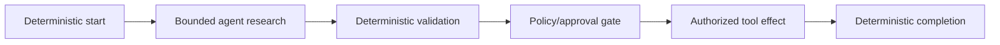
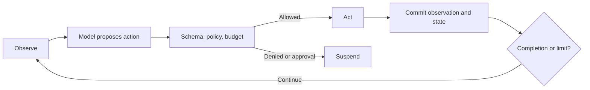

# Agentic control patterns

## Deterministic shell with agentic node



This is the preferred production shape: agentic choice inside an explicit lifecycle.

## Observe–propose–authorize–act



Persist structured goals, plans, observations, actions, evidence, and results. The platform need not expose or store private hidden reasoning.

Use only with bounded action catalog, hard limits, measurable progress, and independently authorized effects.

## Planner–executor

```text
Goal -> typed Plan artifact -> deterministic plan validation
-> executor workflow -> progress monitor -> bounded replan or completion
```

A plan is advisory until validated. Plan steps can reference only known activity/capability types and cannot create permissions. Replanning creates a new immutable plan version.

## Critique–revise

```text
candidate -> critique -> revise -> deterministic + semantic verification
-> complete, iterate, or escalate
```

Store every iteration result immutably. Stop on quality threshold, maximum iterations, hard budget, or no-progress rule. Evaluate improvement per iteration and regressions introduced by revision.

## Search over alternatives

Represent a bounded frontier of candidate states, scores, and depth. Keep branches side-effect-free; only a selected verified path may produce external mutations. Prefer conventional deterministic search when it solves the task.

## Runaway controls

- Maximum iterations, branches, depth, tokens, money, and time.
- Repeated action digest and no-progress detection.
- Required evidence or score improvement.
- Declared fallback and human escalation.
- Delegation depth and child-count limits.
