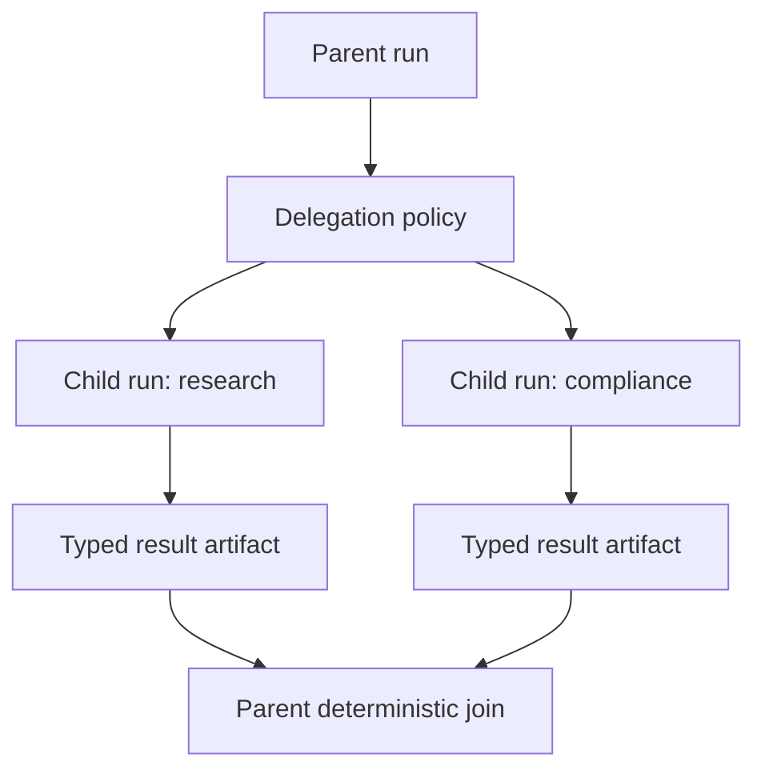

# Child agents and multi-agent orchestration

## Child versus contained activity

A child run is justified when work needs independent state, budget, permissions, timeout, cancellation, long suspension, result, evaluation, or failure status. Otherwise use a model or agent activity in the parent workflow.



## Delegation contract

```typescript
interface AgentDelegation {
  parentRunId: RunId;
  childRunId: RunId;
  agentVersion: AgentVersionRef;
  task: TaskSnapshot;
  delegatedCapabilities: CapabilityGrant;
  memoryScope: MemoryScope;
  budget: BudgetAllocation;
  deadline: Instant;
  resultSchema: SchemaRef;
}
```

## Least authority

The child receives only the capabilities needed for its task. It does not implicitly receive parent secrets, private memory, mutating tools, tenant-wide access, or permission to create grandchildren.

## Coordination policies

```text
wait_for_all
first_acceptable
quorum
required_plus_optional
deadline_best_available
cancel_remaining_after_selection
```

The parent consumes immutable child results. Children do not mutate parent state directly.

## Failure policy

Define whether parent completion requires every child, whether optional children may fail, how budgets are returned, when remaining children are cancelled, and whether a failed child may be replaced by a new child run/version.

## External agents

At an organizational boundary, use an A2A/service adapter through a collaboration gateway. Preserve remote identity, task, capability, result, and artifact evidence without importing opaque remote state into the local `RunState`.

## Evaluation

Measure delegation correctness, least-privilege grants, child task success, duplicate work, parent synthesis, cancellation propagation, coordination latency, delegation cycles, and aggregate cost.
