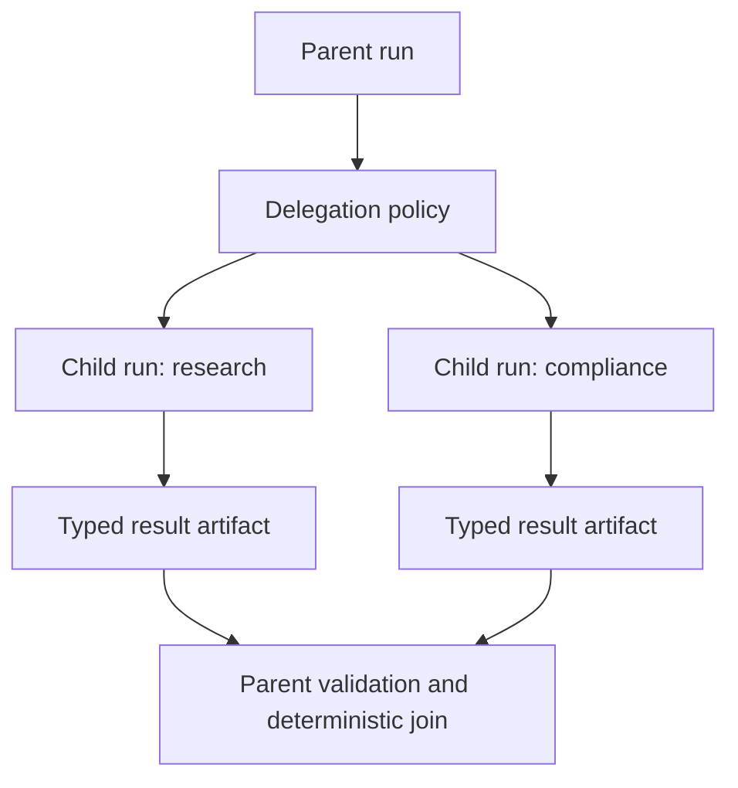

# Child agents and multi-agent orchestration

## Child versus contained activity

A child run is justified when work needs independent state, budget, permissions, timeout, cancellation, long suspension, result, evaluation, or failure status. Otherwise use a model or agent activity in the parent workflow.



## Delegation contract

```typescript
interface AgentDelegation {
  parentRunId: RunId;
  childRunId: RunId;
  agentVersion: AgentVersionRef;
  task: TaskSnapshot;
  delegatedCapabilities: CapabilityGrant;
  memoryScope: MemoryScope;
  budget: BudgetAllocation;
  deadline: Instant;
  resultSchema: SchemaRef;
  messageAudience: AgentIdentityRef;
  issuedAt: Instant;
  expiresAt: Instant;
  nonce: string;
}
```

## Least authority

The child receives only the capabilities needed for its task. It does not implicitly receive parent secrets, private memory, mutating tools, tenant-wide access, or permission to create grandchildren.

## Message security

Parent/child and external-agent messages use authenticated channels or signed envelopes, stable message IDs, audience binding, expiry, and replay protection. Treat every child result as untrusted input: validate schema, provenance, tenant scope, data classification, and semantic preconditions before updating parent state or proposing effects.

A child’s policy decision does not authorize an effect in the parent. The parent re-evaluates policy under its own identity, deployment, and current state.

## Coordination policies

```text
wait_for_all
first_acceptable
quorum
required_plus_optional
deadline_best_available
cancel_remaining_after_selection
```

The parent consumes immutable child results. Children do not mutate parent state directly.

## Failure policy

Define whether parent completion requires every child, whether optional children may fail, how budgets are returned, when remaining children are cancelled, whether a failed child may be replaced, and how duplicate or late child results are handled.

## External agents

At an organizational boundary, use an A2A/service adapter through a collaboration gateway. Preserve remote identity, task, capability, message integrity, result, and artifact evidence without importing opaque remote state into local `RunState`.

## Evaluation

Measure delegation correctness, least-privilege grants, message authentication/replay behavior, malicious-child-output handling, child task success, duplicate work, parent synthesis, cancellation propagation, coordination latency, delegation cycles, and aggregate cost.
