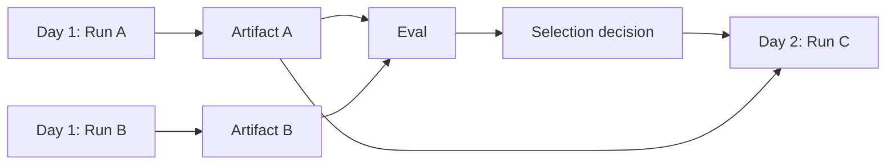

# Cross-run chaining and experiments

## Cross-run chaining

Use an execution plan when work spans separate workflow versions, owners, schedules, evaluations, or days.



Run C records exact upstream run, artifact digest, decision ID, and input binding. It never reads an unspecified “current best result.”

## Dependency policies

```text
all_successful
any_successful
artifact_required
quality_threshold
selected_variant
manual_selection
time_window_closed
fallback
```

## Experiment domain model

```text
Experiment
  hypothesis
  variants
  cohort or dataset snapshot
  assignment policy
  primary metrics and guardrails
  analysis method and window
  selection decision
```

An experiment is domain-owned. It may use an `ExecutionPlanRun` to coordinate variant `WorkflowRun`s.

## Fair comparison

Freeze the input cohort/dataset and all non-experimental variables where possible. Record every intentional difference: agent, workflow, prompt, model route, tool, policy, or strategy version.

## Selection policy

```yaml
hardRequirements:
  policyCompliance: 1.0
  taskCompletion: ">= 0.90"
optimize:
  metric: quality
  tieBreaker: lowerCost
```

Do not choose solely by average LLM-judge score. Include deterministic outcomes, safety guardrails, uncertainty, important slices, cost, and latency.

## Shadow execution

A candidate may receive production inputs without applying production mutations. Reuse recorded tool results, invoke only read-only tools, or run against sandbox systems. The candidate output is evaluation evidence, not production truth.

## Plan-level observability

Use separate traces per workflow run, shared `executionPlanRunId` or `experimentId`, span links, and artifact/decision lineage. Avoid one multi-day trace.
