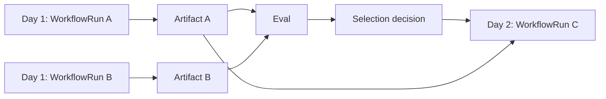

# Cross-run chaining and experiments

> **Status: Informative pattern.** `Experiment`, `ExperimentVariant`, and `ExperimentTrial` belong to an experiment/evaluation bounded context.

## Cross-run chaining

Use an execution plan when work spans separate workflow versions, owners, schedules, evaluations, decisions, or days.



Run C records the exact upstream run, artifact digest, decision ID, and input binding. It never reads an unspecified current-best result.

## Experiment model

```text
Experiment
└── ExperimentRun
    ├── hypothesis and frozen baseline
    ├── ExperimentVariant A
    │   ├── ExperimentTrial A1 -> WorkflowRunRef
    │   └── ExperimentTrial A2 -> WorkflowRunRef
    ├── ExperimentVariant B
    │   ├── ExperimentTrial B1 -> WorkflowRunRef
    │   └── ExperimentTrial B2 -> WorkflowRunRef
    ├── metrics and hard gates
    ├── analysis method and window
    └── selection decision
```

An `ExperimentVariant` identifies a configuration such as model A versus model B. An `ExperimentTrial` is one independent repetition from the same frozen baseline. An `Iteration` is sequential and consumes updated state or evidence. An `Invocation` is one concrete provider call for an `Effect`.

A small implementation may put experiment ID, variant ID, trial ordinal, and baseline-snapshot reference directly on each `WorkflowRun` instead of creating a separate trial aggregate.

## Fair comparison

Freeze the cohort/dataset, participant state, prompts, policies, tools, budgets, cache policy, scheduler policy, and every non-experimental variable where possible. Record every intentional difference and balance scheduling when capacity or time of day may affect results.

If participant and deliberation models both change between A/A and B/B, the experiment compares complete configurations. Use a factorial A/A, A/B, B/A, B/B design when individual and interaction effects must be separated.

## Selection policy

```yaml
hardGateRegistry: enterprise-agent-safety@1.0.0
hardRequirements:
  taskCompletion: ">= 0.90"
optimize:
  metric: quality
  tieBreaker: lowerCost
```

Do not choose solely by average LLM-judge score. Include deterministic outcomes, uncertainty, important slices, cost, latency, and repeated-trial failure modes.

## Harbor terminology

Harbor calls one native evaluation execution a `Trial`. The adapter preserves that native ID. When the execution is one independent repetition from a frozen platform baseline, it maps to an `ExperimentTrial` referencing the evaluated `WorkflowRun`. It never maps to an `Invocation` retry.

## Shadow execution

A candidate may receive production inputs without applying production mutations. Reuse recorded results, invoke read-only tools, or run against sandbox systems. Candidate output is evaluation evidence, not production truth.

## Plan-level observability

Use a separate trace per workflow run, a shared execution-plan/experiment ID, span links, explicit variant and experiment-trial IDs, and artifact/decision lineage. Avoid one multi-day trace.
