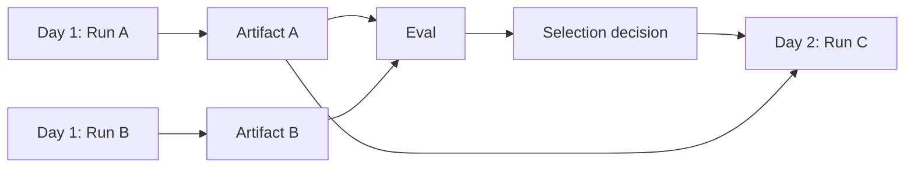

# Cross-run chaining and experiments

## Cross-run chaining

Use an execution plan when work spans separate workflow versions, owners, schedules, evaluations, or days.



Run C records exact upstream run, artifact digest, decision ID, and input binding. It never reads an unspecified current-best result.

## Experiment domain model

```text
Experiment
  hypothesis
  variants
  cohort/dataset and baseline snapshots
  assignment and scheduling policy
  TrialRuns per variant
  primary metrics and hard gates
  analysis method/window
  selection decision
```

A `SimulationVariantRun` compares a configuration such as model A versus model B. A `TrialRun` is one independent stochastic repetition from the same frozen baseline. An `IterationRun` is sequential and consumes updated state. An `InvocationAttempt` is only a concrete provider call/retry for one effect.

```text
Variant A
├── TrialRun A1
├── TrialRun A2
└── TrialRun A3

Variant B
├── TrialRun B1
├── TrialRun B2
└── TrialRun B3
```

## Fair comparison

Freeze the input cohort/dataset, participant state, prompts, policies, tools, budgets, cache policy, and non-experimental variables. Record every intentional difference and balance scheduling when provider capacity or time-of-day may affect results.

If participant and deliberation models both change between A/A and B/B, the experiment compares complete configurations. Use a factorial A/A, A/B, B/A, B/B design to isolate interaction effects when required.

## Selection policy

```yaml
hardGateRegistry: enterprise-agent-safety@1.0.0
hardRequirements:
  taskCompletion: ">= 0.90"
optimize:
  metric: quality
  tieBreaker: lowerCost
```

Do not choose solely by average LLM-judge score. Include deterministic outcomes, uncertainty, important slices, cost, latency, and repeated-trial failure modes.

## Harbor terminology

Harbor calls one agent execution against a task a `Trial`. The evaluation adapter maps it to a platform evaluation trial and, when it is an independent repetition from a frozen baseline, to `TrialRun` semantics. It is never mapped to an effect `InvocationAttempt`.

## Shadow execution

A candidate may receive production inputs without applying production mutations. Reuse recorded results, invoke read-only tools, or run against sandbox systems. Candidate output is evaluation evidence, not production truth.

## Plan-level observability

Use separate traces per workflow run, a shared plan/experiment ID, span links, explicit variant/trial IDs, and artifact/decision lineage. Avoid one multi-day trace.
