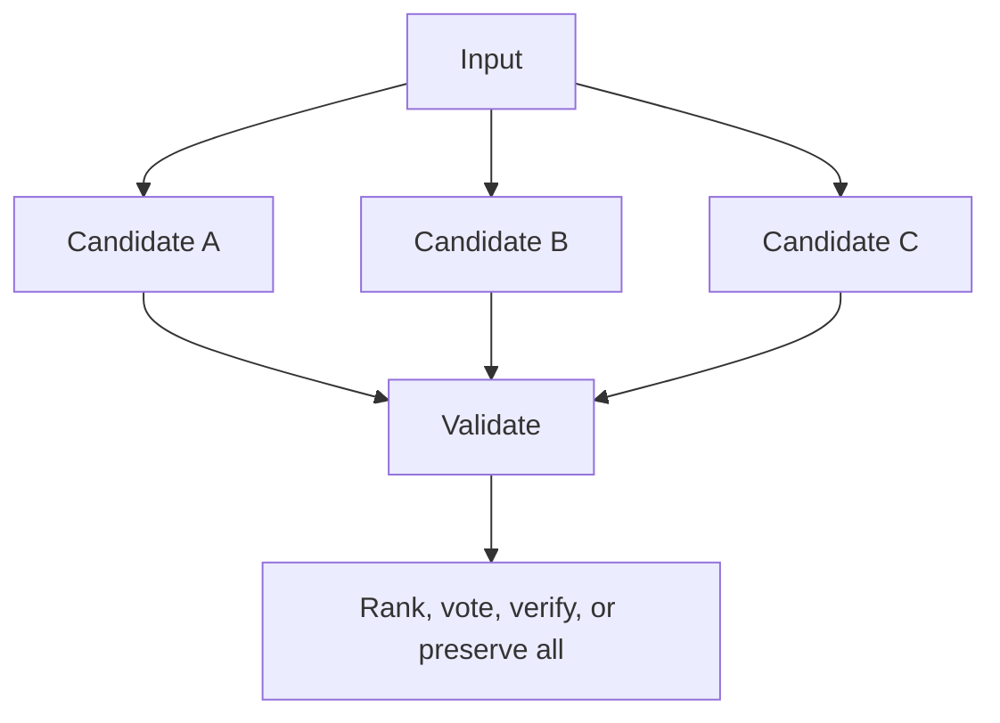

# Ensembles, iterations, and deliberation

## Universal model

Do not make `Round` the universal abstraction. Use:

```text
ActivityRun
  execution strategy
  scheduler
  execution branches
  aggregator
  completion policy
  optional IterationRuns
```

A **round** is a valid domain-facing name for one debate or deliberation iteration. An iteration may execute a complete multi-step body workflow.

## Best-of-N



Candidates are intentional branches; retries within a candidate remain `AttemptRun`s. Compare the strategy against the strongest individual candidate and report incremental value per added branch.

## Multi-model ensemble

Different model routes use one common input snapshot and normalized output schema. Record each branch model route, prompt snapshot, result, usage, and evaluation. Aggregation may use deterministic verification, ranking, weighted vote, evidence merge, synthesis, or preserved dissent.

Use only when model diversity provides measured value and policy permits all providers/regions.

## Survey then deliberate


Collect initial views independently before sharing them when anchoring and groupthink matter. Deliberation should verify disputed claims, not reward persuasive wording.

## Iteration body

```text
IterationRun
  -> body WorkflowRun
       independent contributions
       normalization
       contradiction analysis
       challenge/rebuttal
       evidence verification
       synthesis
       progress evaluation
```

## Completion policy

Use semantic conditions plus hard bounds:

```yaml
stopWhen:
  evidenceCoverage: ">= 0.90"
  unresolvedCriticalContradictions: 0
  consensusScore: ">= 0.80"
hardLimits:
  maximumIterations: 4
  maximumCostUsd: 8.00
noProgress:
  maximumStagnantIterations: 1
  minimumImprovement: 0.02
```

Valid outcomes include consensus, partial consensus, documented dissent, insufficient evidence, irreconcilable disagreement, budget stop, or human judgment required. Do not force false consensus.
