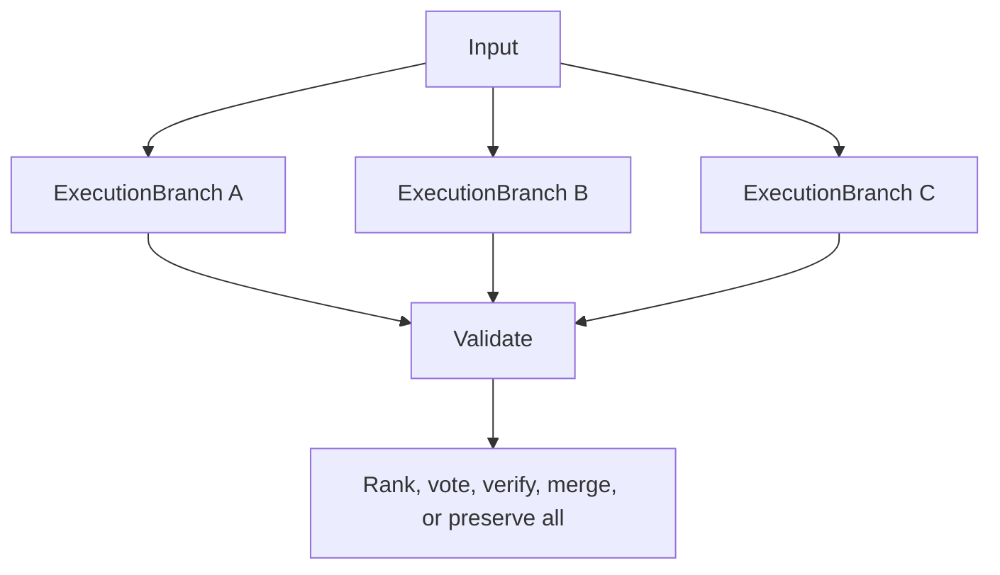
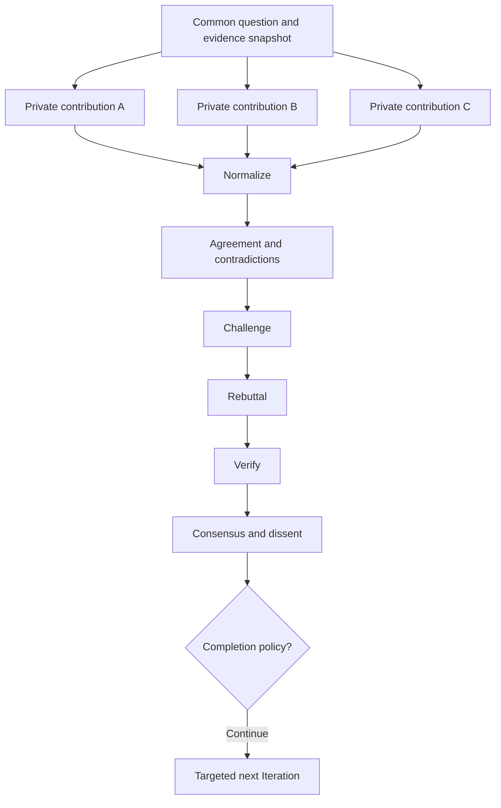

# Ensembles, iterations, and deliberation

> **Status: Informative pattern.** Do not make `Round` a universal runtime abstraction.

## Universal model

```text
ActivityRun
├── execution strategy
├── Scheduler policy
├── ExecutionBranches
├── aggregation policy
├── completion policy
└── optional Iterations
```

A **round** is valid only as a qualified domain-facing term such as `DeliberationRound`. It maps to an `Iteration` and may execute a complete multi-activity workflow body.

## Best-of-N



Candidates are intentional `ExecutionBranch`es. A provider-call retry inside one candidate is another `Invocation` for the same `Effect`; a whole-activity restart is an `ActivityAttempt`. Compare the strategy against the strongest individual candidate and report incremental value per added branch.

## Multi-model ensemble

Different model routes use one common input snapshot and normalized output schema. Record each branch’s model route, prompt/context snapshot, effects, invocations, result, usage, and evaluation. Aggregation may use deterministic verification, ranking, weighted vote, evidence merge, synthesis, or preserved dissent.

Use an ensemble only when measured diversity benefits justify added cost, latency, correlated-error risk, and provider/data-policy exposure.

## Survey then deliberate



Collect initial views independently when anchoring and groupthink matter. Deliberation should verify disputed claims and preserve dissent rather than reward persuasive wording.

## Iteration body

```text
Iteration
└── body WorkflowRun or inline workflow body
    ├── independent contributions
    ├── normalization
    ├── contradiction analysis
    ├── challenge/rebuttal
    ├── evidence verification
    ├── synthesis
    └── progress evaluation
```

## Completion policy

Use semantic conditions plus hard bounds:

```yaml
stopWhen:
  evidenceCoverage: ">= 0.90"
  unresolvedCriticalContradictions: 0
  consensusScore: ">= 0.80"
hardLimits:
  maximumIterations: 4
  maximumCost: { amount: "8.00", currency: USD }
noProgress:
  maximumStagnantIterations: 1
  minimumImprovement: "0.02"
```

Valid outcomes include consensus, partial consensus, documented dissent, insufficient evidence, irreconcilable disagreement, budget stop, or human judgment required. Do not force false consensus.
