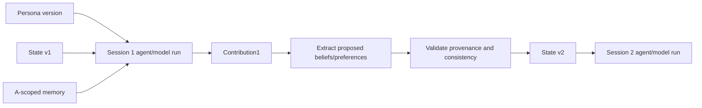

# Longitudinal synthetic participants

This is a domain extension built on the reference architecture, not a universal core entity.

## Persistent identity model

```text
SyntheticParticipantDefinition
  -> SyntheticParticipantVersion
    -> SyntheticParticipantInstance
         stable participant ID
         immutable persona version
         versioned participant state
         scoped memory records
         sessions and contributions
```

The participant is durable. A model invocation or agent run simulating the participant is ephemeral.

## What makes A the same A?

1. Stable `participantId`.
2. Pinned immutable persona version.
3. Explicit prior state version.
4. Scoped memories derived from prior contributions.
5. Versioned session and contribution history.
6. Evaluation of continuity and justified change.

This guarantees input and identity continuity, not identical language or decisions from a nondeterministic model.

## Session execution



Use a model activity for one bounded response, an agent activity for multi-step evidence/reasoning inside the study workflow, and a child agent run only for independent lifecycle, permissions, budget, or long waits.

## Memory types

- Episodic: what happened in one session.
- Semantic: a belief or learned fact.
- Preference: value and strength.
- Commitment: conditional or explicit statement.
- Relationship: prior interaction with another participant.
- Deliberation: position changed after shared evidence.

Every record has participant scope and provenance. A must never retrieve B’s private memory. Shared study evidence and deliberation transcripts are separate scopes.

## State evolution

Do not overwrite history:

```text
State v1: prefers X, confidence 0.62
State v2: prefers X, confidence 0.72
State v3: prefers Y because of new privacy evidence
```

A contribution proposes changes. Deterministic extraction/validation and domain rules commit a new state version.

## Survey and deliberation

Collect initial responses privately. Create an explicitly attributed or anonymized shared evidence artifact. Run bounded deliberation. Store updated participant positions separately from original views.

## Evaluation and research validity

Measure persona adherence, longitudinal consistency, memory recall, justified opinion change, cross-participant leakage, stereotype amplification, response diversity, sensitivity to model choice, and agreement with real human validation data.

Synthetic participants are simulations. They must not be represented as equivalent to empirical human-subject evidence without external validation and clear disclosure.
