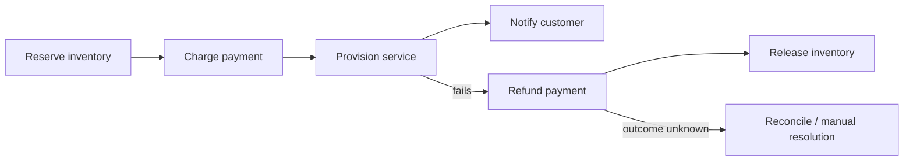

# Saga and compensation

Use a saga when one business process spans multiple transactional systems and a single distributed ACID transaction is unavailable or undesirable.

> A compensation is a new semantic effect. It does not erase the original event or guarantee exact restoration of the prior world state.

## Example — provision a paid subscription



## Definition model

```yaml
activities:
  - id: reserve-inventory
    type: tool
    effect: reversible_write
    compensateWith: release-inventory
  - id: charge-payment
    type: tool
    effect: irreversible_write
    reconcileWith: payment-status
    compensateWith: refund-payment
  - id: provision-service
    type: tool
    effect: reversible_write
    compensateWith: deprovision-service
```

Every forward and compensation activity declares its own input/output schema, effect classification, idempotency, reconciliation, policy, budget, retry, and approval semantics.

## Runtime model

```text
Saga WorkflowRun
├── EffectRecord: reserve inventory
├── EffectRecord: charge payment
├── EffectRecord: provision service -> failed
├── EffectRecord: refund payment
└── EffectRecord: release inventory
```

Both the charge and refund remain visible in journal, audit, lineage, and usage.

## Compensation policy

| Question | Required decision |
|---|---|
| Trigger | Downstream failure, cancellation, policy reversal, or manual request |
| Order | Reverse order, dependency order, or domain-specific order |
| Preconditions | Resource still compensatable, legal/time window, current state |
| Failure | Retry, reconcile, alternate mitigation, or manual resolution |
| Concurrency | Prevent forward and compensating effect racing |
| Approval | Whether compensation itself requires authorization |
| Completion | Fully compensated, partially compensated, mitigated, unresolved |

## Irreversible effects

Some effects have no true compensation: external publication, legal filing, disclosed secret, physical shipment, or completed payment. Define mitigation such as retraction, correction, refund, notification, credential rotation, or manual case handling. Do not label a mitigation as a rollback guarantee.

## Cancellation

Cancellation stops new forward effects and starts compensation only when policy requires it. It must not blindly compensate an effect whose outcome is unknown; reconcile first.

## Evaluation and testing

- Forward-path correctness.
- Every failure point and compensation branch.
- Duplicate forward and compensation delivery.
- Ambiguous forward/compensation outcomes.
- Compensation ordering and idempotency.
- Manual-resolution evidence.
- Time to stable business outcome.
- Residual state after partial compensation.
